# Scenario: Automated Shadow Monitoring Cutover Workflow

> **v2.3.0** | Related docs: [`shadow-monitoring-sop.md`](../shadow-monitoring-sop.md), [`getting-started/for-platform-engineers.md`](../getting-started/for-platform-engineers.md), [`migration-guide.md`](../migration-guide.md)

## Problem

Organizations migrating from legacy alerting systems (vendor-specific rule sets or manual threshold maintenance) face core risks:

- **Rule behavior discrepancies**: Are new rules truly equivalent to old ones? Do they produce identical metrics?
- **Downtime-free migration**: Cannot interrupt alerting services during cutover
- **Long verification windows**: New and old rules must run in parallel for 1–2 weeks of observation
- **Manual cutover is error-prone**: Multiple system interactions (Prometheus rules, Alertmanager, ConfigMap reloads) create operational complexity

## Solution: Automated Shadow Monitoring Cutover

Dynamic Alerting provides an end-to-end migration workflow:

1. **Compliance scanning** (`onboard_platform.py`) — Parse legacy config, generate migration hints
2. **Rule transformation** (`migrate_rule.py`) — Convert old rules to new rules, auto-mark as shadow
3. **Parallel validation** (`validate_migration.py`) — Continuously compare new vs old outputs until auto-detecting convergence
4. **One-click cutover** (`cutover_tenant.py`) — Automate all cutover steps (remove old rules, unshadow new rules, verify notifications)
5. **Automatic rollback** (rollback mechanism) — Fast recovery if cutover issues detected

## Workflow Diagram

```mermaid
graph LR
    A["Existing Alerts<br/>(Legacy System)"] -->|Import| B["onboard_platform.py<br/>Reverse-engineer"]
    B -->|Generate| C["onboard-hints.json<br/>Migration hints"]
    C -->|Reference| D["migrate_rule.py<br/>Transform rules"]
    D -->|Deploy| E["New Rules<br/>migration_status: shadow<br/>(Alertmanager blocks)"]
    A -->|Run in parallel| E
    E -->|Validate| F["validate_migration.py<br/>--watch continuous check"]
    F -->|7+ days zero delta| G["cutover-readiness.json<br/>Auto-generated<br/>(auto-detect-convergence)"]
    G -->|Manual confirm| H["cutover_tenant.py<br/>--readiness-json<br/>--dry-run"]
    H -->|Preview| I{Looks good?}
    I -->|Yes| J["cutover_tenant.py<br/>Execute cutover"]
    I -->|No| K["Adjust config<br/>Re-validate"]
    K -->|Re-check| F
    J -->|Step 1| L["Delete old rules<br/>(Stop shadow-monitor job)"]
    L -->|Step 2| M["Remove migration_status<br/>shadow label"]
    M -->|Step 3| N["Alertmanager remove<br/>shadow intercept route"]
    N -->|Step 4| O["Verify alerts fire<br/>check-alert + diagnose"]
    O -->|Pass| P["Cutover complete ✓"]
    O -->|Fail| Q["Auto-rollback<br/>(rollback mechanism)"]
    Q -->|Restore| E
```



## Key Decision Points

### 1. Convergence Detection

New and old rules are deemed "behaviorally equivalent" when:

| Condition | Verification | Notes |
|-----------|--------------|-------|
| **Numeric accuracy** | delta < tolerance (default 0.1%) | Rate-based metrics can relax to 1% |
| **Continuous period** | 7 consecutive days of zero mismatches | Spans full business week |
| **Peak/valley coverage** | Timestamps cover peak and off-peak hours | Validates scaling scenarios |
| **All tenants** | Every tenant has validation data | No orphaned tenants |
| **Operational mode** | normal (not silent/maintenance) | Ensures platform runs normally |

**Auto-convergence detection** :

```bash
# validate_migration.py auto-detects and generates cutover-readiness.json
python3 scripts/tools/ops/validate_migration.py \
  --mapping migration_output/prefix-mapping.yaml \
  --prometheus http://localhost:9090 \
  --watch --interval 300 --rounds 4032 \
  --auto-detect-convergence --stability-window 5
  # stability-window=5: 5 consecutive rounds of zero mismatch → convergence declared
```

Output: `validation_output/cutover-readiness.json` (contains `converged`, `convergence_timestamp`, `tenants_verified`, `recommendation` fields). Use `da-tools shadow-verify convergence --readiness-json <path>` to auto-interpret.

### 2. Tolerance Thresholds

Different metric types warrant different tolerances:

| Metric type | Default tolerance | Adjustment scenario |
|-------------|-------------------|-------------------|
| Absolute values (connections, threads) | 0.1% | Rarely adjusted |
| Rate (QPS, throughput) | 1% | Higher volatility, can relax |
| Percentile (p95 latency) | 5% | Spike-sensitive, higher margin |
| Ratio (utilization %) | 0.5% | Moderate sensitivity |

Pass `--tolerance` to `validate_migration.py`:

```bash
python3 scripts/tools/ops/validate_migration.py \
  --mapping migration_output/prefix-mapping.yaml \
  --prometheus http://localhost:9090 \
  --watch \
  --tolerance 0.01  # 1% tolerance
```

### 3. Rollback Triggers

Post-cutover, these conditions trigger automatic rollback:

| Condition | Detection | Rollback action |
|-----------|-----------|-----------------|
| **Alert firing mismatch** | `check-alert` returns firing state discrepancy | Restore old rules + re-run validate |
| **Notification delivery failure** | Alertmanager queue backlog or webhook errors | Restore old AM config |
| **Tenant mode anomaly** | `diagnose` shows operational_mode ≠ normal | Halt cutover, retry after recovery |
| **Metric missing** | New rule metrics suddenly stop | Restore old rules, check Prometheus |

## Step-by-Step Workflow

### Phase 1: Preparation (Day -1)

```bash
# 1.1 Back up current alert config
cp -r conf.d conf.d.bak
cp -r alertmanager.yml alertmanager.yml.bak

# 1.2 Scan and analyze current config
python3 scripts/tools/ops/onboard_platform.py \
  --legacy-config /path/to/old_rules/ \
  --output migration_input/
# Output: onboard-hints.json (rule mapping hints, manual adjustments needed, estimated effort)

# 1.3 Verify environment readiness
python3 scripts/tools/ops/validate_config.py \
  --config-dir conf.d/ \
  --policy .github/custom-rule-policy.yaml
```

### Phase 2: Transformation (Day 0)

```bash
# 2.1 Execute rule transformation
python3 scripts/tools/ops/migrate_rule.py \
  --input migration_input/onboard-hints.json \
  --tenant db-a,db-b \
  --output migration_output/
# Output:
#   - migration_output/custom_rules.yaml (new rules with migration_status: shadow)
#   - migration_output/prefix-mapping.yaml (old_query ↔ new_query mapping)

# 2.2 Deploy new rules (shadow state)
kubectl apply -f migration_output/custom_rules.yaml

# 2.3 Update Alertmanager to intercept shadow alerts
kubectl patch configmap alertmanager-config -n monitoring \
  --patch-file alertmanager-shadow-route.patch

# 2.4 Reload Prometheus and Alertmanager
kubectl rollout restart deployment prometheus -n monitoring
kubectl rollout restart deployment alertmanager -n monitoring
```

### Phase 3: Validation (Days 1–14)

```bash
# 3.1 Start parallel validation
python3 scripts/tools/ops/validate_migration.py \
  --mapping migration_output/prefix-mapping.yaml \
  --prometheus http://localhost:9090 \
  --watch --interval 300 --rounds 4032 \
  --auto-detect-convergence --stability-window 7 \
  -o validation_output/

# 3.2 Daily inspection (automated via shadow-verify)
da-tools shadow-verify runtime \
  --report-csv validation_output/validation-report.csv \
  --prometheus http://localhost:9090
# If mismatches appear, see shadow-monitoring-sop.md §5 for troubleshooting
```

### Phase 4: Pre-Cutover Verification (Day 14+)

```bash
# 4.1 Convergence verification
da-tools shadow-verify convergence \
  --report-csv validation_output/validation-report.csv \
  --readiness-json validation_output/cutover-readiness.json \
  --prometheus http://localhost:9090

# 4.2 Dry-run mode (--dry-run)
python3 scripts/tools/ops/cutover_tenant.py \
  --readiness-json validation_output/cutover-readiness.json \
  --tenant db-a \
  --prometheus http://localhost:9090 \
  --dry-run

# Expected output:
# [DRY RUN] Would stop shadow-monitor job in namespace monitoring
# [DRY RUN] Would delete old recording rules for tenant db-a
# [DRY RUN] Would remove migration_status:shadow label from custom_* rules
# [DRY RUN] Would remove Alertmanager shadow route for db-a
# [DRY RUN] Would run: check-alert MariaDBHighConnections db-a
# [DRY RUN] Would run: diagnose db-a

# 4.3 Confirm preview and execute cutover
```

### Phase 5: Cutover Execution (Day 14+)

```bash
# 5.1 Execute single-tenant cutover
python3 scripts/tools/ops/cutover_tenant.py \
  --readiness-json validation_output/cutover-readiness.json \
  --tenant db-a \
  --prometheus http://localhost:9090

# Expected flow (auto-executed):
# [STEP 1/4] Stopping shadow monitor job...
# [STEP 2/4] Removing old recording rules for tenant db-a...
# [STEP 3/4] Removing migration_status:shadow label...
# [STEP 4/4] Verifying alert triggers post-cutover...
# ✓ db-a cutover completed successfully
# ✓ All validation checks passed

# 5.2 Batch cutover multiple tenants (sequential execution)
for tenant in db-a db-b db-c; do
  echo "[INFO] Cutting over $tenant..."
  python3 scripts/tools/ops/cutover_tenant.py \
    --readiness-json validation_output/cutover-readiness.json \
    --tenant "$tenant" \
    --prometheus http://localhost:9090

  sleep 60  # 60-second interval between tenants to avoid Prometheus reload conflicts
done

# 5.3 Verify all cutovers succeeded
python3 scripts/tools/ops/batch_diagnose.py \
  --prometheus http://localhost:9090 \
  --check-shadow-removal
```

### Phase 6: Cleanup (Day 15+)

```bash
# 6.1 Verify old rules completely removed (batch-diagnose includes shadow-removal check)
python3 scripts/tools/ops/batch_diagnose.py \
  --prometheus http://localhost:9090 --check-shadow-removal

# 6.2 Clean up migration artifacts and backups
rm -rf migration_input/ migration_output/ validation_output/
rm -rf conf.d.bak alertmanager.yml.bak
```

## Common Scenarios and Responses

### Scenario 1: Numeric Mismatch During Validation

**Symptom**: `validation-report.csv` shows persistent `mismatch` entries

**Diagnosis**:

```bash
# View specific mismatched metric pairs
grep "mismatch" validation_output/validation-report.csv | head -5

# Manual comparison query
curl -s "http://localhost:9090/api/v1/query?query=<old_query>" | python3 -m json.tool
curl -s "http://localhost:9090/api/v1/query?query=<new_query>" | python3 -m json.tool
```

**Common causes**:

| Cause | Signature | Fix |
|-------|-----------|-----|
| Aggregation logic differs | new = old × N | Check `max by` vs `sum by` |
| Label mismatch | old_missing / new_missing | Check recording rule `by` clause |
| Eval window differs | delta constant but tiny | Verify rate[5m] / [1m] consistency |
| Tolerance too strict | delta < 0.05% but still mismatches | Increase tolerance (e.g., 0.01 = 1%) |

**Fix workflow**:

1. Adjust `migrate_rule.py` transformation logic or tolerance parameter
2. Re-transform rules (Phase 2)
3. Restart validation (Phase 3, new watch cycle)
4. Confirm 7 days zero-mismatch before re-executing Phase 4

### Scenario 2: Alert Doesn't Fire Post-Cutover

**Symptom**: `check-alert` returns `no active alerts`

**Diagnosis**:

```bash
# Check if new rules are evaluated
curl -s http://localhost:9090/api/v1/rules | \
  jq '.data.groups[] | select(.name | contains("custom_"))'

# Check if Alertmanager is still blocking
kubectl logs -n monitoring deployment/alertmanager | grep "custom_" | tail -10

# Check tenant operational mode
python3 scripts/tools/ops/diagnose.py db-a
```

**Common causes**:

| Cause | Fix |
|-------|-----|
| New rules not loaded by Prometheus | Confirm ConfigMap reload completed, wait 1–2 eval intervals |
| Alertmanager route still intercepts | Verify shadow route fully removed |
| Tenant in silent/maintenance mode | Wait for `_state_silent_mode: expires` to elapse |
| Threshold set too high | Use `baseline_discovery.py` to re-suggest thresholds |

### Scenario 3: Need Immediate Rollback

**Operation**:

```bash
# 3.1 Immediately block new rule notifications (temporary)
kubectl patch configmap alertmanager-config -n monitoring \
  --patch-file alertmanager-block-custom.patch  # Temporarily intercept custom_* alerts

# 3.2 Execute full rollback
python3 scripts/tools/ops/cutover_tenant.py \
  --tenant db-a \
  --rollback --prometheus http://localhost:9090
# Auto: restores old rules, old AM config, re-starts validation

# 3.3 Root cause analysis
# - Check new rule logic for bugs
# - Check threshold-exporter configuration
# - Check Rule Pack for conflicts
```

## Real-World Cases and Time References

### Case 1: Standard Single-Tenant Migration (Tenant DB-A)

| Phase | Work | Duration | Notes |
|-------|------|----------|-------|
| Preparation | onboard + migrate | 2h | Includes tool learning curve on first run |
| Validation | 7 days continuous | 7d | Spans complete business cycle |
| Cutover | cutover + verification | 30m | Fully automated |
| Cleanup | Remove artifacts + final check | 1h | Includes backup verification |
| **Total** | | **7.5 days** | |

### Case 2: Multi-Tenant Batch Migration (DB-A, DB-B, DB-C)

| Phase | Duration | Notes |
|-------|----------|-------|
| Unified prep (Day -1) | 2h | Single onboard; multiple migrates (serial exec, but parallel feasible) |
| Unified validation (Days 1–7) | 7d | All tenants monitored in same validate job |
| Batch cutover (Day 8) | 1.5h | 3 × 30m, 1 min between tenants |
| **Total** | **7.5 days** | Same as single tenant (validation phase dominates) |

### Case 3: Mismatch Discovered and Fixed (Day 3 anomaly)

| Operation | Duration |
|-----------|----------|
| Detect mismatch (monitoring) | Automatic |
| Diagnose root cause | 2h |
| Adjust migrate params + re-transform | 1h |
| Restart validation | 7d |
| **Total additional** | **7 days** |

## Advanced Options

### Option A: Accelerated Validation (--tolerance relaxed + --stability-window shortened)

To accept higher risk and speed up validation:

```bash
# Relax tolerance to 5%, declare convergence at 3 consecutive zero-mismatch rounds
python3 scripts/tools/ops/validate_migration.py \
  --mapping migration_output/prefix-mapping.yaml \
  --prometheus http://localhost:9090 \
  --watch --interval 300 --rounds 288 \
  --auto-detect-convergence --stability-window 3 \
  --tolerance 0.05

# Validation period reduces from 14 days to ~3 days
# Risk: rate-based metrics susceptible to short-term volatility false positives
```

**When to use**: Test environments, low-risk tenants (e.g., dev)

### Option B: --force Skip Readiness Check

When manual validation is thorough, skip auto-readiness checks:

```bash
# Skip cutover-readiness.json validation, proceed directly
python3 scripts/tools/ops/cutover_tenant.py \
  --tenant db-a \
  --prometheus http://localhost:9090 \
  --force  # Does not require --readiness-json
```

**When to use**: Manual CSV review confirms 7 days zero-mismatch; test/dev environments

**Avoid when**: Production, critical tenants

## Checklist

Before starting migration:

- [ ] Current config backed up (`conf.d.bak`, `alertmanager.yml.bak`)
- [ ] `validate_config.py` passes
- [ ] `onboard_platform.py` complete, `onboard-hints.json` reviewed
- [ ] `migrate_rule.py` complete, new rules deployed
- [ ] Alertmanager shadow route deployed
- [ ] Prometheus reload complete
- [ ] `validate_migration.py` running without errors

Before cutover:

- [ ] `cutover-readiness.json` generated (or manual verification of 7 days zero-mismatch)
- [ ] `--dry-run` preview shows no anomalies
- [ ] Pagerduty/Slack notification paths tested (prevent alert loss during cutover)
- [ ] On-call SRE confirmed available for 1-hour rollback window if needed

After cutover:

- [ ] `check-alert` verification passes
- [ ] `diagnose` shows no anomalies
- [ ] Old rules completely removed
- [ ] Backups archived

## Related Resources

| Resource | Relevance |
|----------|-----------|
| ["Scenario: Automated Shadow Monitoring Cutover Workflow"](shadow-monitoring-cutover.en.md) | ⭐⭐⭐ |
| ["Advanced Scenarios & Test Coverage"](advanced-scenarios.en.md) | ⭐⭐ |
| ["Shadow Monitoring SRE SOP"](../shadow-monitoring-sop.en.md) | ⭐⭐ |
| ["da-tools CLI Reference"](../cli-reference.en.md) | ⭐⭐ |
| ["Grafana Dashboard Guide"](../grafana-dashboards.en.md) | ⭐⭐ |
| ["Scenario: Same Alert, Different Semantics — Platform/NOC vs Tenant Dual-Perspective Notifications"](alert-routing-split.en.md) | ⭐⭐ |
| ["Scenario: Multi-Cluster Federation Architecture — Central Thresholds + Edge Metrics"](multi-cluster-federation.en.md) | ⭐⭐ |
| ["Scenario: Complete Tenant Lifecycle Management"](tenant-lifecycle.en.md) | ⭐⭐ |
