# 場景：Shadow Monitoring 全自動切換工作流

> **v2.0.0-preview** | 相關文件：[`shadow-monitoring-sop.md`](../shadow-monitoring-sop.md)、[`getting-started/for-platform-engineers.md`](../getting-started/for-platform-engineers.md)、[`migration-guide.md`](../migration-guide.md)

## 問題

組織正在從傳統告警系統（如特定廠商告警規則集或人工閾值維護）遷移到 Dynamic Alerting 平台，面臨的核心風險：

- **規則行為差異**：新規則與舊規則的邏輯是否完全等價？數值輸出是否一致？
- **無停機轉換**：無法在遷移期間中斷告警服務
- **驗證時間長**：新舊規則並行運行需要 1–2 週的觀察期
- **手工切換容易出錯**：多個系統聯動（Prometheus rule、Alertmanager、ConfigMap reload）

## 解決方案：Shadow Monitoring 全自動切換

Dynamic Alerting 提供端到端的遷移工作流，包含：

1. **合規性掃描**（`onboard_platform.py`）— 解析舊配置，產出遷移提示
2. **規則轉換**（`migrate_rule.py`）— 舊規則 → 新規則，自動標記為 shadow 狀態
3. **並行驗證**（`validate_migration.py`）— 連續比對新舊規則輸出，直到自動檢測到收斂
4. **一鍵切換**（`cutover_tenant.py`）— 自動化完成所有切換步驟（刪舊規則、移除 shadow 標籤、驗證通知）
5. **自動回退**（rollback 機制）— 若切換後發現問題，快速恢復舊規則

## 工作流程圖

```mermaid
graph LR
    A["現有告警<br/>（舊系統）"] -->|導入| B["onboard_platform.py<br/>反向分析"]
    B -->|產出| C["onboard-hints.json<br/>遷移提示"]
    C -->|參考| D["migrate_rule.py<br/>規則轉換"]
    D -->|部署| E["新規則<br/>migration_status: shadow<br/>（被 AM 攔截）"]
    A -->|並行運行| E
    E -->|驗證| F["validate_migration.py<br/>--watch 持續監測"]
    F -->|7天+ 無差異| G["cutover-readiness.json<br/>自動產出<br/>（auto-detect-convergence）"]
    G -->|手動確認| H["cutover_tenant.py<br/>--readiness-json<br/>--dry-run"]
    H -->|preview| I{確認無誤？}
    I -->|是| J["cutover_tenant.py<br/>執行切換"]
    I -->|否| K["修改配置<br/>重新驗證"]
    K -->|再驗| F
    J -->|Step 1| L["刪除舊規則<br/>（Shadow Monitor Job）"]
    L -->|Step 2| M["移除 migration_status<br/>shadow label"]
    M -->|Step 3| N["Alertmanager 移除<br/>shadow 攔截 route"]
    N -->|Step 4| O["驗證告警觸發<br/>check-alert + diagnose"]
    O -->|通過| P["完成切換 ✓"]
    O -->|失敗| Q["自動回退<br/>（rollback 機制）"]
    Q -->|恢復| E
```



## 關鍵決策點

### 1. 收斂偵測（Convergence Detection）

新舊規則「行為等價」由以下條件判定：

| 條件 | 驗證方式 | 說明 |
|------|--------|------|
| **數值誤差** | delta < tolerance（預設 0.1%） | rate-based metrics 可適度放寬至 1% |
| **連續週期** | 連續 7 天 0 mismatch | 涵蓋週一至週日完整業務週期 |
| **峰谷覆蓋** | 時間戳跨越業務高峰+低谷 | 確保 scaling 場景也通過驗證 |
| **所有 tenant** | 每個 tenant 至少有驗證數據 | 無遺漏租戶 |
| **運營模式** | normal（非 silent/maintenance） | 確保比對期間平台正常運行 |

**自動收斂偵測**：

```bash
# validate_migration.py 自動偵測收斂並產出 cutover-readiness.json
python3 scripts/tools/validate_migration.py \
  --mapping migration_output/prefix-mapping.yaml \
  --prometheus http://localhost:9090 \
  --watch --interval 300 --rounds 4032 \
  --auto-detect-convergence --stability-window 5
  # stability-window=5 表示連續 5 輪無 mismatch 即宣告收斂
```

輸出：`validation_output/cutover-readiness.json`（包含 `converged`、`convergence_timestamp`、`tenants_verified`、`recommendation` 等欄位）。可用 `da-tools shadow-verify convergence --readiness-json <path>` 自動解讀。

### 2. 容忍度閾值（Tolerance Thresholds）

不同類型的指標應設置差異化的容忍度：

| 指標類型 | 預設容忍度 | 調整場景 |
|---------|----------|--------|
| 絕對值（connections、threads） | 0.1% | 極少調整 |
| Rate（QPS、throughput） | 1% | 波動較大，可放寬 |
| Percentile（p95 latency） | 5% | 尖峰敏感，容忍度較高 |
| Ratio（利用率 %） | 0.5% | 中等敏感 |

在 `validate_migration.py` 中傳入 `--tolerance` 參數：

```bash
python3 scripts/tools/validate_migration.py \
  --mapping migration_output/prefix-mapping.yaml \
  --prometheus http://localhost:9090 \
  --watch \
  --tolerance 0.01  # 1% 容忍度
```

### 3. 回退條件（Rollback Triggers）

切換後若檢測到以下情況，立即觸發自動回退：

| 條件 | 檢測方式 | 回退操作 |
|------|--------|--------|
| **Alert 誤報** | `check-alert` 返回 firing state mismatch | 恢復舊規則 + 重啟 validate |
| **通知失敗** | Alertmanager 通知隊列堆積或 webhook 失敗 | 恢復 AM 舊設定 |
| **Tenant 模式異常** | `diagnose` 發現 operational_mode ≠ normal | 中止切換，待恢復後重試 |
| **指標缺失** | 新規則產出的 metric 突然斷檔 | 恢復舊規則，檢查 Prometheus 狀態 |

## 逐步工作流

### 階段 1：準備（Day -1）

```bash
# 1.1 備份現有告警配置
cp -r conf.d conf.d.bak
cp -r alertmanager.yml alertmanager.yml.bak

# 1.2 掃描並分析現有配置
python3 scripts/tools/onboard_platform.py \
  --legacy-config /path/to/old_rules/ \
  --output migration_input/
# 產出：onboard-hints.json（含規則映射提示、需手工調整的項目、預計遷移工作量）

# 1.3 驗證環境就緒
python3 scripts/tools/validate_config.py \
  --config-dir conf.d/ \
  --policy .github/custom-rule-policy.yaml
```

### 階段 2：轉換（Day 0）

```bash
# 2.1 執行規則轉換
python3 scripts/tools/migrate_rule.py \
  --input migration_input/onboard-hints.json \
  --tenant db-a,db-b \
  --output migration_output/
# 產出：
#   - migration_output/custom_rules.yaml（新規則，帶 migration_status: shadow）
#   - migration_output/prefix-mapping.yaml（old_query ↔ new_query 映射）

# 2.2 部署新規則（shadow 狀態）
kubectl apply -f migration_output/custom_rules.yaml

# 2.3 更新 Alertmanager，攔截 shadow alert
kubectl patch configmap alertmanager-config -n monitoring \
  --patch-file alertmanager-shadow-route.patch

# 2.4 reload Prometheus 和 Alertmanager
kubectl rollout restart deployment prometheus -n monitoring
kubectl rollout restart deployment alertmanager -n monitoring
```

### 階段 3：驗證（Day 1–14）

```bash
# 3.1 啟動並行驗證
python3 scripts/tools/validate_migration.py \
  --mapping migration_output/prefix-mapping.yaml \
  --prometheus http://localhost:9090 \
  --watch --interval 300 --rounds 4032 \
  --auto-detect-convergence --stability-window 7 \
  -o validation_output/

# 3.2 日常巡檢（每日一次，使用 shadow-verify 自動化）
da-tools shadow-verify runtime \
  --report-csv validation_output/validation-report.csv \
  --prometheus http://localhost:9090
# 若有 mismatch，參見 shadow-monitoring-sop.md §5 異常處理
```

### 階段 4：切換前確認（Day 14+）

```bash
# 4.1 收斂驗證
da-tools shadow-verify convergence \
  --report-csv validation_output/validation-report.csv \
  --readiness-json validation_output/cutover-readiness.json \
  --prometheus http://localhost:9090

# 4.2 乾運行模式（--dry-run）
python3 scripts/tools/cutover_tenant.py \
  --readiness-json validation_output/cutover-readiness.json \
  --tenant db-a \
  --prometheus http://localhost:9090 \
  --dry-run

# 預期輸出：
# [DRY RUN] Would stop shadow-monitor job in namespace monitoring
# [DRY RUN] Would delete old recording rules for tenant db-a
# [DRY RUN] Would remove migration_status:shadow label from custom_* rules
# [DRY RUN] Would remove Alertmanager shadow route for db-a
# [DRY RUN] Would run: check-alert MariaDBHighConnections db-a
# [DRY RUN] Would run: diagnose db-a

# 4.3 確認預覽無誤後執行切換
```

### 階段 5：切換執行（Day 14+）

```bash
# 5.1 執行單個 tenant 切換
python3 scripts/tools/cutover_tenant.py \
  --readiness-json validation_output/cutover-readiness.json \
  --tenant db-a \
  --prometheus http://localhost:9090

# 預期流程（自動執行）：
# [STEP 1/4] Stopping shadow monitor job...
# [STEP 2/4] Removing old recording rules for tenant db-a...
# [STEP 3/4] Removing migration_status:shadow label...
# [STEP 4/4] Verifying alert triggers post-cutover...
# ✓ db-a cutover completed successfully
# ✓ All validation checks passed

# 5.2 批次切換多個 tenant（逐一執行）
for tenant in db-a db-b db-c; do
  echo "[INFO] Cutting over $tenant..."
  python3 scripts/tools/cutover_tenant.py \
    --readiness-json validation_output/cutover-readiness.json \
    --tenant "$tenant" \
    --prometheus http://localhost:9090

  sleep 60  # 每個 tenant 間隔 60 秒，避免 Prometheus reload 沖突
done

# 5.3 驗證全部切換成功
python3 scripts/tools/batch_diagnose.py \
  --prometheus http://localhost:9090 \
  --check-shadow-removal
```

### 階段 6：清理（Day 15+）

```bash
# 6.1 確認舊規則已完全移除（batch-diagnose 含 shadow-removal 檢查）
python3 scripts/tools/batch_diagnose.py \
  --prometheus http://localhost:9090 --check-shadow-removal

# 6.2 清理遷移產物與備份
rm -rf migration_input/ migration_output/ validation_output/
rm -rf conf.d.bak alertmanager.yml.bak
```

## 常見情況與應對

### 情況 1：驗證期間發現數值 Mismatch

**症狀**：`validation-report.csv` 中持續出現 `mismatch` 項目

**診斷與修復**：詳見 [Shadow Monitoring SOP §5](../shadow-monitoring-sop.md) 的完整 Mismatch/Missing 診斷表。常見原因包括聚合邏輯差異、label 不匹配、評估窗口差異。修復後需重新轉換規則並重啟驗證（新一輪 watch + 7 天無 mismatch）。

### 情況 2：切換後 Alert 仍未觸發

**症狀**：`check-alert` 返回 `no active alerts`

**常見原因與修復**：

| 原因 | 修復 |
|------|------|
| 新規則未被 Prometheus 載入 | 確認 ConfigMap reload 完成，等待 1–2 個 eval interval |
| Alertmanager route 還在攔截 | 檢查 shadow route 是否被完全移除 |
| Tenant 處於 silent/maintenance 模式 | 等待 `expires` 期滿自動恢復，或手動清除 |
| 閾值設置過高 | 使用 `baseline_discovery.py` 重新建議閾值 |

使用 `da-tools diagnose <tenant>` 快速確認運營模式與 exporter 狀態。

### 情況 3：需要快速回退

**操作**：

```bash
# 3.1 立即停止新規則通知（暫時方案）
kubectl patch configmap alertmanager-config -n monitoring \
  --patch-file alertmanager-block-custom.patch  # 臨時攔截 custom_* alerts

# 3.2 執行完整回退
python3 scripts/tools/cutover_tenant.py \
  --tenant db-a \
  --rollback --prometheus http://localhost:9090
# 自動：恢復舊規則、恢復舊 AM 設定、重啟驗證

# 3.3 根本原因分析
# - 檢查新規則邏輯是否有誤
# - 檢查 threshold-exporter 配置是否正確
# - 檢查 Rule Pack 是否有衝突
```

## 真實案例與時間參考

### 案例 1：標準 Single-Tenant 遷移（DB-A 租戶）

| 階段 | 工作內容 | 耗時 | 備註 |
|------|--------|------|------|
| 準備 | onboard + migrate | 2h | 首次遷移，包含工具學習曲線 |
| 驗證 | 7 天連續監測 | 7d | 跨越完整業務週期 |
| 切換 | cutover + 驗證 | 30m | 全自動執行 |
| 清理 | 移除產物 + 最終檢驗 | 1h | 包含備份驗證 |
| **總計** | | **7.5 天** | |

### 案例 2：多租戶批次遷移（DB-A、DB-B、DB-C）

| 階段 | 耗時 | 說明 |
|------|------|------|
| 統一準備（Day -1） | 2h | 一次性 onboard；multiple migrate（平行可行但需序列執行 AM patch） |
| 統一驗證（Day 1–7） | 7d | 所有 tenant 在同一 validate job 中並行監測 |
| 批次切換（Day 8） | 1.5h | 3 × 30m，tenant 間隔 1 分鐘 |
| **總計** | **7.5 天** | 與單 tenant 相同（驗證週期支配） |

### 案例 3：發現 Mismatch 並修復（Day 3 異常）

| 操作 | 耗時 |
|------|------|
| 發現 mismatch（監測） | 自動 |
| 診斷根本原因 | 2h |
| 調整 migrate 參數 + 重新轉換 | 1h |
| 重啟驗證 | 7d |
| **總額外耗時** | **7 天** |

## 高級選項

### 選項 A：加速驗證（--tolerance 寬鬆 + --stability-window 縮短）

若組織願意接受更高風險，可加速驗證期：

```bash
# 容忍度提寬至 5%，連續 3 輪無 mismatch 即宣告收斂
python3 scripts/tools/validate_migration.py \
  --mapping migration_output/prefix-mapping.yaml \
  --prometheus http://localhost:9090 \
  --watch --interval 300 --rounds 288 \
  --auto-detect-convergence --stability-window 3 \
  --tolerance 0.05

# 驗證週期從 14 天降至 ~3 天
# 風險：rate-based metrics 容易出現短期波動誤報
```

**何時使用**：測試環境、低風險租戶（如開發環境）

### 選項 B：--force 跳過 Readiness 檢查

在確保手工驗證充分的情況下，可跳過自動 readiness 檢查：

```bash
# 跳過 cutover-readiness.json 驗證，直接切換
python3 scripts/tools/cutover_tenant.py \
  --tenant db-a \
  --prometheus http://localhost:9090 \
  --force  # 不需要 --readiness-json
```

**何時使用**：已手工審視 CSV 報告確認 7 天無 mismatch；測試/開發環境

**何時避免**：生產環境、關鍵租戶

## 檢查清單

遷移前確保完成：

- [ ] 現有配置已備份（`conf.d.bak`, `alertmanager.yml.bak`）
- [ ] 執行 `validate_config.py` 通過
- [ ] 執行 `onboard_platform.py` 完成，`onboard-hints.json` 已審視
- [ ] 執行 `migrate_rule.py` 完成，新規則已部署
- [ ] Alertmanager shadow route 已部署
- [ ] Prometheus reload 完成
- [ ] `validate_migration.py` 正常運行，無錯誤日誌

切換前確保完成：

- [ ] `cutover-readiness.json` 已產出（或手工確認 7 天無 mismatch）
- [ ] `--dry-run` 預覽無異常
- [ ] Pagerduty/Slack 通知管道已測試（避免切換期間丟失告警）
- [ ] 待命 SRE 已確認，能於 1 小時內進行回退

切換後確保完成：

- [ ] `check-alert` 驗證通過
- [ ] `diagnose` 確認無異常
- [ ] 舊規則已完全移除
- [ ] 備份已歸檔

## 相關資源

| 資源 | 相關性 |
|------|--------|
| ["場景：Shadow Monitoring 全自動切換工作流"](scenarios/shadow-monitoring-cutover.md) | ⭐⭐⭐ |
| ["進階場景與測試覆蓋"](scenarios/advanced-scenarios.md) | ⭐⭐ |
| ["Shadow Monitoring SRE SOP"](./shadow-monitoring-sop.md) | ⭐⭐ |
| ["da-tools CLI Reference"](./cli-reference.md) | ⭐⭐ |
| ["Grafana Dashboard 導覽"](./grafana-dashboards.md) | ⭐⭐ |
| ["場景：同一 Alert、不同語義 — Platform/NOC vs Tenant 雙視角通知"](scenarios/alert-routing-split.md) | ⭐⭐ |
| ["場景：多叢集聯邦架構 — 中央閾值 + 邊緣指標"](scenarios/multi-cluster-federation.md) | ⭐⭐ |
| ["場景：租戶完整生命週期管理"](scenarios/tenant-lifecycle.md) | ⭐⭐ |
