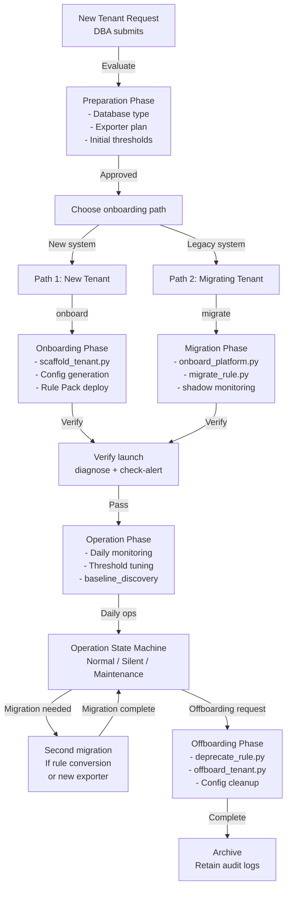

# Scenario: Complete Tenant Lifecycle Management

> **v2.5.0** | Related docs: [`getting-started/for-platform-engineers.md`](../getting-started/for-platform-engineers.md), [`getting-started/for-tenants.md`](../getting-started/for-tenants.md), [`architecture-and-design.md` §2.1](../architecture-and-design.md)

## Overview

This document describes the complete lifecycle of a tenant in the Dynamic Alerting platform, from **launch** to **offboarding**:

- **Preparation Phase** (Pre-Launch): Assess requirements, plan alert strategy
- **Onboarding Phase**: Establish configuration, deploy rules, verify alerts
- **Operation Phase**: Daily monitoring, threshold tuning, mode management
- **Migration Phase**: Migrate from legacy system (optional)
- **Offboarding Phase**: Complete cleanup and archival

## Lifecycle Flowchart



## Path 1: New Tenant Onboarding (No Migration)

For tenants being set up from scratch (no legacy rule conversion needed).

### Phase 1.1: Preparation (Day -7 ~ -1)

#### 1.1.1 Gather Requirements

```bash
# Confirm with tenant/DBA using form or ticket

□ Tenant name: e.g., db-product-01
□ Database type: PostgreSQL / MySQL / MongoDB / Redis / etc
□ Namespaces: ns-prod, ns-staging (can be multiple)
□ Cluster: Single cluster / Multi-cluster (multi-cluster: use "Multi-Cluster Federation" scenario)
□ Exporter status: Already exists / Need deployment
□ Initial threshold reference: Baseline data / Industry standard / Vendor recommendation
□ Notification recipients: DBA team email / Slack channel / Other
□ Priority: Tier-1 / Tier-2 / Tier-3 (affects alert severity and notification frequency)
□ Special needs: Silent mode planning / Maintenance windows / Custom annotations
```

#### 1.1.2 Initialize Tenant Config Framework

```bash
# Use interactive mode
python3 scripts/tools/ops/scaffold_tenant.py

# Or non-interactive with parameters
python3 scripts/tools/ops/scaffold_tenant.py \
  --tenant db-product-01 \
  --db postgresql \
  --namespaces ns-prod,ns-staging \
  --non-interactive \
  --output conf.d/

# Output:
# - conf.d/db-product-01.yaml (tenant config framework)
# - scaffold-report.txt (planning document)
```

#### 1.1.3 Plan Rule Packs and Exporters

`scaffold-report.txt` includes recommended Rule Pack list. Select required Rule Packs based on DB type (see [Rule Packs README](../rule-packs/README.md)), and confirm corresponding Exporters are deployed or in deployment plan.

#### 1.1.4 Negotiate Initial Thresholds with DBA

Three strategies:

| Strategy | Approach | Use Case |
|----------|----------|----------|
| **A: Platform Defaults** | Use `_defaults.yaml` directly | Quick launch, may need tuning initially |
| **B: Tenant-Specific** | Set values in `conf.d/<tenant>.yaml` | Aligns with operations (recommended) |
| **C: Observe & Adjust** | Start with defaults, then `da-tools baseline --tenant <t> --duration 604800` after 1 week | Most conservative |

### Phase 1.2: Onboarding (Day 0)

#### 1.2.1 Deploy and Verify

```bash
# 1. Verify config correctness
da-tools validate-config --config-dir conf.d/

# 2. Apply config to ConfigMap (see migration-guide §1 for injection methods)
kubectl create configmap threshold-config --from-file=conf.d/ -n monitoring --dry-run=client -o yaml | kubectl apply -f -

# 3. One-command comprehensive health check
da-tools diagnose db-product-01
# Expected: ✓ Configuration loaded, ✓ Metrics present, ✓ Alert rules loaded, ✓ Routing configured
```

Verification includes: threshold-exporter loaded, Prometheus metrics present, Rule Pack alert rules evaluating, Alertmanager routing configured.

#### 1.2.2 One-Command Verification

```bash
# Comprehensive health check
python3 scripts/tools/ops/diagnose.py db-product-01 \
  --prometheus http://localhost:9090

# Expected output:
# ✓ Configuration loaded
# ✓ Metrics present: 50+
# ✓ Alert rules: 15+
# ✓ Operational mode: normal
# ✓ Notification channel: verified
# ✓ Health score: 95%
```

### Phase 1.3: Production Verification (Days 0–3)

```bash
# Monitor for 3 days to ensure no false positives or missed alerts

# Daily check
python3 scripts/tools/ops/diagnose.py db-product-01

# View live alerts
curl -s http://prometheus:9090/api/v1/alerts | \
  jq '.data.alerts[] | select(.labels.tenant == "db-product-01")'

# Verify notifications arrive
# - Confirm DBA received test notifications
# - Verify notification format is complete and actionable
```

## Path 2: Migrating Tenant (From Legacy System)

For tenants already running on other platforms needing migration to Dynamic Alerting. See scenario "Automated Shadow Monitoring Cutover Workflow".

**Quick summary**:

| Phase | Work | Duration |
|-------|------|----------|
| Prep | onboard_platform.py (scan legacy rules) | 2h |
| Transform | migrate_rule.py (generate new rules) | 2h |
| Validate | validate_migration.py (7 days parallel test) | 7d |
| Cutover | cutover_tenant.py (one-click switch) | 30m |

## Phase 2: Operation (Day 4+)

### 2.1 Daily Monitoring and Maintenance

#### 2.1.1 Daily Check

```bash
# Run every morning
python3 scripts/tools/ops/diagnose.py db-product-01
python3 scripts/tools/ops/check_alert.py MariaDBHighConnections db-product-01

# Checklist
□ operational_mode: normal / silent / maintenance
□ alert_count: Any abnormal increase or disappearance?
□ metric_lag: Any metric delay?
□ notification_backlog: Notification queue healthy?
```

#### 2.1.2 Weekly Aggregation

```bash
# Generate multi-tenant health report weekly
python3 scripts/tools/ops/batch_diagnose.py \
  --output weekly-report.json

# Report includes:
# - Health scores for all tenants
# - Alert firing trends
# - Problem tenant list
# - Recommended adjustments
```

### 2.2 Threshold Tuning

#### Detect False Positives

```bash
# Observe historical patterns, get threshold suggestions
da-tools baseline --tenant db-product-01 --duration 604800
# Adjust thresholds in conf.d/<tenant>.yaml based on p95/p99 recommendations
```

#### Detect Missed Alerts

```bash
# Confirm metric exists + rule evaluates + threshold set
da-tools diagnose db-product-01
da-tools check-alert PostgreSQLHighConnections db-product-01
# If threshold too high, lower and verify
```

#### Backtest Threshold Changes

```bash
# Before modifying, backtest impact using historical data (compare new vs old config)
da-tools backtest --config-dir conf.d --baseline conf.d-old --lookback 7
```

### 2.3 Operational Mode Management

Dynamic Alerting provides Normal / Silent / Maintenance three-state operational modes, all supporting `expires` auto-expiry. For full design and YAML syntax, see [Core Design §2.7](../design/config-driven.en.md#27-three-state-operational-modes).

Common operations:

```bash
# Enable silent mode (during maintenance)
da-tools patch-config --tenant db-product-01 --set '_state_silent_mode.enabled=true' --set '_state_silent_mode.expires=2026-03-20T23:59:59Z'

# Verify current mode
da-tools diagnose db-product-01
# Output: operational_mode: silent

# Scheduled maintenance windows (CronJob auto-creates Alertmanager silences)
da-tools maintenance-scheduler --config-dir conf.d/ --alertmanager http://alertmanager:9093
```

## Phase 3: Special Operations

### 3.1 Custom Rules

For tenant-specific monitoring needs not covered by default Rule Packs, deploy custom rules.

```bash
# 1. Write custom rules (Prometheus PromQL)
cat > custom-rules.yaml <<'EOF'
groups:
  - name: custom-db-product-01
    rules:
      - alert: CustomHighQueryTime
        expr: |
          histogram_quantile(0.95,
            sum by(le, tenant) (rate(query_duration_seconds_bucket{tenant="db-product-01"}[5m]))
          ) > 10
        for: 5m
        annotations:
          summary: "Query latency p95 > 10s on {{ $labels.tenant }}"
EOF

# 2. Validate custom rules
python3 scripts/tools/ops/lint_custom_rules.py custom-rules.yaml

# 3. Deploy
kubectl apply -f custom-rules.yaml

# 4. Verify loaded
curl -s http://prometheus:9090/api/v1/rules | \
  jq '.data.groups[] | select(.name | contains("custom-"))'
```

### 3.2 Multi-Namespace Tenants

For tenants running across multiple namespaces (prod-ns + staging-ns), specify in config:

```yaml
# conf.d/db-product-01.yaml
tenants:
  db-product-01:
    _namespaces: ["prod-ns", "staging-ns", "canary-ns"]
    # threshold-exporter aggregates metrics from all namespaces
    # E.g., pg_connections aggregates connection counts across all namespaces
```

### 3.3 Cross-Cluster Tenants (Multi-Cluster Scenario)

For tenants with data across multiple K8s clusters, reference "Multi-Cluster Federation" scenario. Core principles:

1. Each edge cluster deploys DB exporters
2. Central collects metrics via federation or remote-write
3. Central manages thresholds and alerting centrally

```yaml
# conf.d/db-product-01.yaml (central)
tenants:
  db-product-01:
    _namespaces: ["prod-ns"]
    _cluster: "edge-asia-prod"  # Specify edge cluster location
    pg_connections: "70"
    _routing: { ... }
```

## Phase 4: Offboarding

### 4.1 Prepare and Execute

```bash
# 1. Notify stakeholders (recommend 7-day advance notice)
# 2. Back up config
cp conf.d/db-product-01.yaml conf.d.archive/

# 3. Automated offboarding (recommended)
da-tools offboard db-product-01 --dry-run  # Pre-check
da-tools offboard db-product-01            # Execute

# 4. Offboard legacy custom rules (if migrated)
da-tools deprecate custom_pg_connections custom_pg_replication_lag --config-dir conf.d
```

### 4.2 Verify and Archive

```bash
# Confirm tenant fully removed
curl -s 'http://prometheus:9090/api/v1/query?query={tenant="db-product-01"}' | jq '.data.result | length'
# Expected: 0

# Archive backups
tar czf archive/db-product-01-offboarding-$(date +%Y%m%d).tar.gz conf.d.archive/
```

## Common Scenarios

### Scenario A: Standard PostgreSQL Tenant (New Onboarding)

| Item | Content |
|------|---------|
| Tenant name | db-analytics |
| Database | PostgreSQL 13 |
| Namespace | analytics-prod |
| Initial Rule Pack | postgresql (required) + shared (required) |
| Initial thresholds | Use defaults |
| Onboarding time | 1–2 hours |
| First adjustment | Day 3–7 based on operational patterns |

### Scenario B: Multi-Database Tenant (PostgreSQL + Redis)

| Item | Content |
|------|---------|
| Tenant name | db-cache-01 |
| Database | PostgreSQL + Redis (multi-exporter) |
| Initial Rule Pack | postgresql + redis + shared |
| Exporter | postgres_exporter + redis_exporter (dual deployment) |
| Onboarding time | 2–3 hours (dual exporter config) |

### Scenario C: Cross-Cluster Tenant (Multi-Cluster Federation)

| Item | Content |
|------|---------|
| Tenant name | db-global |
| Deployment | 3 edge clusters (Asia + Europe + Americas) |
| Config | One in central, three edge relabel configs |
| Rule Pack | Complete set in central; each edge scrapes exporters |
| Onboarding time | 4–6 hours (3 edge clusters to configure) |
| Reference | "Multi-Cluster Federation" scenario |

### Scenario D: Migrating Tenant (From Legacy System)

| Item | Content |
|------|---------|
| Tenant name | db-legacy |
| Legacy system | Nagios / Zabbix / Custom alerting |
| Migration flow | onboard → migrate → validate (7 days) → cutover |
| Duration | 7.5 days (validation dominates) |
| Reference | "Automated Shadow Monitoring Cutover Workflow" scenario |

## Tool Quick Reference

| Tool | Purpose | Common command |
|------|---------|--------|
| **scaffold_tenant.py** | New tenant onboarding | `--tenant <name> --db <type> --output conf.d/` |
| **diagnose.py** | Health check | `<tenant> --prometheus <url>` |
| **check_alert.py** | Alert status query | `<alertname> <tenant>` |
| **baseline_discovery.py** | Threshold suggestions | `--tenant <name> --duration 604800` |
| **backtest_threshold.py** | Test threshold changes | `--tenant <name> --old-threshold 80 --new-threshold 75` |
| **batch_diagnose.py** | Multi-tenant report | `--output report.json` |
| **lint_custom_rules.py** | Custom rule validation | `custom-rules.yaml` |
| **offboard_tenant.py** | Tenant offboarding | `--tenant <name> --archival-dir ./archive/` |
| **deprecate_rule.py** | Rule offboarding | `rule-name-1 rule-name-2 --execute` |
| **onboard_platform.py** | Pre-migration scan | `--legacy-config /path/ --output migration_input/` |
| **migrate_rule.py** | Rule migration transform | `--input hints.json --tenant <name> --output migration_output/` |
| **validate_migration.py** | Parallel migration test | `--mapping prefix-mapping.yaml --watch --auto-detect-convergence` |
| **cutover_tenant.py** | Migration switch | `--tenant <name> --readiness-json file.json --dry-run` |

## Checklist

### Before New Tenant Onboarding

- [ ] Requirements complete (database type, namespaces, notification method)
- [ ] scaffold_tenant.py output reviewed
- [ ] Rule Pack selection confirmed
- [ ] Initial thresholds negotiated (or decision made for defaults+Day 3 tuning)
- [ ] Exporter deployment plan confirmed

### After New Tenant Onboarding

- [ ] validate_config.py passes
- [ ] diagnose.py shows normal output (health score > 80%)
- [ ] Metrics and alert rules verified
- [ ] Alertmanager routing verified
- [ ] DBA received test notification and confirmed

### Before Migrating Tenant Starts

- [ ] onboard_platform.py scan complete
- [ ] migrate_rule.py transform complete
- [ ] validate_migration.py running
- [ ] Shadow rules deployed
- [ ] Alertmanager shadow route configured

### Before Migrating Tenant Cutover

- [ ] 7 days zero-mismatch (or cutover-readiness.json auto-generated)
- [ ] --dry-run preview confirms correctness
- [ ] On-call SRE confirmed available
- [ ] Rollback plan prepared

### Before Tenant Offboarding

- [ ] Stakeholders notified (7-day advance notice)
- [ ] Config and data backed up
- [ ] Historical data queried and saved
- [ ] No other workflows depend on this tenant

### After Tenant Offboarding

- [ ] offboard_tenant.py executed
- [ ] Archival complete (backups uploaded to long-term storage)
- [ ] Cleanup verified (no orphaned config or rules)

## Interactive Tools

> 💡 **Interactive Tools** — The following tools can be tested directly in the [Interactive Tools Hub](https://vencil.github.io/Dynamic-Alerting-Integrations/):
>
> - [Tenant Manager](https://vencil.github.io/Dynamic-Alerting-Integrations/assets/jsx-loader.html?component=../interactive/tools/tenant-manager.jsx) — Step-by-step tenant lifecycle management and onboarding
> - [Config Diff](https://vencil.github.io/Dynamic-Alerting-Integrations/assets/jsx-loader.html?component=../interactive/tools/config-diff.jsx) — Compare configuration changes during lifecycle
> - [Alert Simulator](https://vencil.github.io/Dynamic-Alerting-Integrations/assets/jsx-loader.html?component=../interactive/tools/alert-simulator.jsx) — Test alert firing across tenant phases

## Related Resources

| Resource | Relevance |
|----------|-----------|
| ["Scenario: Complete Tenant Lifecycle Management"](tenant-lifecycle.en.md) | ⭐⭐⭐ |
| ["Advanced Scenarios & Test Coverage"](advanced-scenarios.en.md) | ⭐⭐ |
| ["Scenario: Same Alert, Different Semantics — Platform/NOC vs Tenant Dual-Perspective Notifications"](alert-routing-split.en.md) | ⭐⭐ |
| ["Scenario: Multi-Cluster Federation Architecture — Central Thresholds + Edge Metrics"](multi-cluster-federation.en.md) | ⭐⭐ |
| ["Scenario: Automated Shadow Monitoring Cutover Workflow"](shadow-monitoring-cutover.en.md) | ⭐⭐ |
