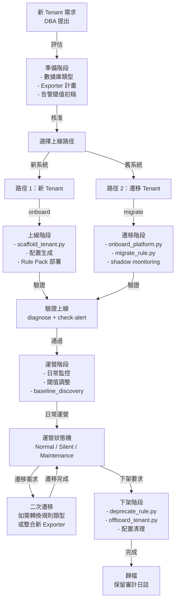

# 場景：租戶完整生命週期管理

> **v2.7.0** | 相關文件：[`getting-started/for-platform-engineers.md`](../getting-started/for-platform-engineers.md)、[`getting-started/for-tenants.md`](../getting-started/for-tenants.md)、[`architecture-and-design.md` §2.1](../architecture-and-design.md)

## 概述

本文件描述在 Dynamic Alerting 平台中，一個租戶從**上線**到**下架**的完整生命週期，包括：

- **準備階段**（Pre-Launch）：評估需求、規劃告警策略
- **上線階段**（Onboarding）：建立配置、部署規則、驗證告警
- **運營階段**（Operation）：日常監控、閾值調整、模式管理
- **遷移階段**（Migration）：從舊系統遷移（可選）
- **下架階段**（Offboarding）：完整清理、歸檔

## 生命週期流程圖



## 路徑 1：新租戶上線（非遷移）

適用於從無到有建立告警的租戶（不涉及舊規則轉換）。

### 階段 1.1：準備（Day -7 ~ -1）

#### 1.1.1 收集需求

```bash
# 與租戶/DBA 確認以下信息
# 可使用 Google Form / Jira ticket 收集

□ 租戶名稱：e.g., db-product-01
□ 數據庫類型：PostgreSQL / MySQL / MongoDB / Redis / etc
□ 命名空間：ns-prod, ns-staging（可多個）
□ 叢集：單叢集 / 多叢集（如多叢集，用場景「多叢集聯邦」）
□ Exporter 現狀：已有 / 需要部署
□ 初始閾值參考：baseline data / 行業標準 / 廠商建議
□ 通知對象：DBA Team 郵箱 / Slack channel / 其他
□ 優先級：Tier-1 / Tier-2 / Tier-3（影響告警嚴重度和通知方式）
□ 特殊需求：silent mode 規劃 / 維護窗口 / 自訂 annotation
```

#### 1.1.2 初始化租戶配置框架

```bash
# 使用 scaffold_tenant.py 的互動模式
python3 scripts/tools/ops/scaffold_tenant.py

# 或指定參數（非互動）
python3 scripts/tools/ops/scaffold_tenant.py \
  --tenant db-product-01 \
  --db postgresql \
  --namespaces ns-prod,ns-staging \
  --non-interactive \
  --output conf.d/

# 輸出：
# - conf.d/db-product-01.yaml（租戶配置框架）
# - scaffold-report.txt（規劃文件）
```

#### 1.1.3 規劃 Rule Pack 和 Exporter

`scaffold-report.txt` 會包含推薦的 Rule Pack 清單。根據 DB 類型選擇必要的 Rule Pack（詳見 [Rule Packs README](../rule-packs/README.md)），確認對應 Exporter 已部署或納入部署計畫。

#### 1.1.4 與 DBA 協商初始閾值

三種策略：

| 策略 | 方法 | 適用場景 |
|------|------|----------|
| **A: 平台默認** | 直接使用 `_defaults.yaml` | 快速上線，初期可能需調整 |
| **B: 租戶自訂** | 在 `conf.d/<tenant>.yaml` 指定值 | 貼近實際運營（推薦） |
| **C: 觀測後調整** | 先用默認，1 周後 `da-tools baseline --tenant <t> --duration 604800` 取得建議 | 最穩妥 |

### 階段 1.2：上線（Day 0）

#### 1.2.1 部署與驗證

```bash
# 1. 驗證配置正確性
da-tools validate-config --config-dir conf.d/

# 2. 應用配置至 ConfigMap（詳見 migration-guide §1 注入方法）
kubectl create configmap threshold-config --from-file=conf.d/ -n monitoring --dry-run=client -o yaml | kubectl apply -f -

# 3. 一鍵全面健康檢查
da-tools diagnose db-product-01
# 預期：✓ Configuration loaded, ✓ Metrics present, ✓ Alert rules loaded, ✓ Routing configured
```

驗證項目包含：threshold-exporter 載入、Prometheus 指標存在、Rule Pack alert rule 評估、Alertmanager 路由配置。

#### 1.2.2 一鍵驗證

```bash
# 使用 diagnose 工具進行全面健康檢查
python3 scripts/tools/ops/diagnose.py db-product-01 \
  --prometheus http://localhost:9090

# 預期輸出：
# ✓ Configuration loaded
# ✓ Metrics present: 50+
# ✓ Alert rules: 15+
# ✓ Operational mode: normal
# ✓ Notification channel: verified
# ✓ Health score: 95%
```

### 階段 1.3：生產驗證（Day 0–3）

```bash
# 持續 3 天監控，確保無誤報和漏報

# 每日檢查
python3 scripts/tools/ops/diagnose.py db-product-01

# 查看實時告警
curl -s http://prometheus:9090/api/v1/alerts | \
  jq '.data.alerts[] | select(.labels.tenant == "db-product-01")'

# 檢查通知是否到達
# - 確認 DBA 已收到測試通知
# - 確認通知格式完整、可操作
```

## 路徑 2：遷移租戶（從舊系統遷移）

適用於已在其他平台運行、需要遷移到 Dynamic Alerting 的租戶。詳見場景「Shadow Monitoring 全自動切換工作流」。

**快速摘要**：

| 階段 | 工作 | 耗時 |
|------|------|------|
| 準備 | onboard_platform.py（掃描舊規則） | 2h |
| 轉換 | migrate_rule.py（生成新規則） | 2h |
| 驗證 | validate_migration.py（7 天並行監測） | 7d |
| 切換 | cutover_tenant.py（一鍵切換） | 30m |

## 階段 2：運營（Day 4+）

### 2.1 日常監控和維護

#### 2.1.1 日報檢查

```bash
# 每日早上執行
python3 scripts/tools/ops/diagnose.py db-product-01
python3 scripts/tools/ops/check_alert.py MariaDBHighConnections db-product-01

# 檢查清單
□ operational_mode: normal / silent / maintenance
□ alert_count: 是否異常增加或消失
□ metric_lag: 指標是否有延遲
□ notification_backlog: 通知隊列是否正常
```

#### 2.1.2 周報聚合

```bash
# 每週生成多租戶健康報告
python3 scripts/tools/ops/batch_diagnose.py \
  --output weekly-report.json

# 報告包含：
# - 所有租戶的健康分數
# - 告警觸發趨勢
# - 異常租戶列表
# - 推薦的調整項目
```

### 2.2 閾值調整

#### 誤報處理

```bash
# 觀測歷史模式，取得閾值建議
da-tools baseline --tenant db-product-01 --duration 604800
# 根據 p95/p99 建議調整 conf.d/<tenant>.yaml 中的閾值
```

#### 漏報處理

```bash
# 確認指標存在 + 規則評估 + 閾值設定
da-tools diagnose db-product-01
da-tools check-alert PostgreSQLHighConnections db-product-01
# 若閾值過高，降低並驗證
```

#### 回測閾值變更

```bash
# 修改前用歷史數據回測影響（比較新舊配置目錄）
da-tools backtest --config-dir conf.d --baseline conf.d-old --lookback 7
```

### 2.3 運營模式管理

Dynamic Alerting 提供 Normal / Silent / Maintenance 三態運營模式，均支援 `expires` 自動失效。完整設計與 YAML 語法見 [核心設計 §2.7](../design/config-driven.md#27-三態運營模式-operational-modes)。

常用操作：

```bash
# 啟用靜默模式（維護期間）
da-tools patch-config --tenant db-product-01 --set '_state_silent_mode.enabled=true' --set '_state_silent_mode.expires=2026-03-20T23:59:59Z'

# 驗證目前模式
da-tools diagnose db-product-01
# 輸出：operational_mode: silent

# 排程式維護窗口（CronJob 自動建立 Alertmanager silence）
da-tools maintenance-scheduler --config-dir conf.d/ --alertmanager http://alertmanager:9093
```

## 階段 3：特殊操作

### 3.1 自訂規則（Custom Rule）

若租戶有特殊監控需求，不被預設 Rule Pack 涵蓋，可部署自訂規則。

```bash
# 1. 編寫自訂規則 (Prometheus PromQL)
cat > custom-rules.yaml <<'EOF'
groups:
  - name: custom-db-product-01
    rules:
      - alert: CustomHighQueryTime
        expr: |
          histogram_quantile(0.95,
            sum by(le, tenant) (rate(query_duration_seconds_bucket{tenant="db-product-01"}[5m]))
          ) > 10
        for: 5m
        annotations:
          summary: "Query latency p95 > 10s on {{ $labels.tenant }}"
EOF

# 2. 驗證自訂規則
python3 scripts/tools/ops/lint_custom_rules.py custom-rules.yaml

# 3. 部署
kubectl apply -f custom-rules.yaml

# 4. 驗證加載
curl -s http://prometheus:9090/api/v1/rules | \
  jq '.data.groups[] | select(.name | contains("custom-"))'
```

### 3.2 多命名空間租戶

若同一租戶在多個命名空間上運行（如 prod-ns + staging-ns），可在配置中指定：

```yaml
# conf.d/db-product-01.yaml
tenants:
  db-product-01:
    _namespaces: ["prod-ns", "staging-ns", "canary-ns"]
    # threshold-exporter 會聚合所有 ns 的指標
    # 例：pg_connections 聚合所有 ns 的連線數
```

### 3.3 跨叢集租戶（多叢集場景）

若租戶數據跨多個 Kubernetes 叢集，參考場景「多叢集聯邦」。核心在於：

1. 邊緣叢集各部署 DB exporter
2. 中央透過 federation 或 remote-write 收集指標
3. 中央統一管理閾值和告警

```yaml
# conf.d/db-product-01.yaml（中央）
tenants:
  db-product-01:
    _namespaces: ["prod-ns"]
    _cluster: "edge-asia-prod"  # 指定所在邊緣叢集
    pg_connections: "70"
    _routing: { ... }
```

## 階段 4：下架

### 4.1 準備與執行

```bash
# 1. 通知相關方（建議 7 天提前期）
# 2. 備份配置
cp conf.d/db-product-01.yaml conf.d.archive/

# 3. 自動化下架（推薦）
da-tools offboard db-product-01 --dry-run  # 預檢
da-tools offboard db-product-01            # 執行

# 4. 下架舊 custom rules（若有遷移過）
da-tools deprecate custom_pg_connections custom_pg_replication_lag --config-dir conf.d
```

### 4.2 驗證與歸檔

```bash
# 確認租戶已完全移除
curl -s 'http://prometheus:9090/api/v1/query?query={tenant="db-product-01"}' | jq '.data.result | length'
# 預期：0

# 歸檔備份
tar czf archive/db-product-01-offboarding-$(date +%Y%m%d).tar.gz conf.d.archive/
```

## 常見場景

### 場景 A：標準 PostgreSQL 租戶（新上線）

| 項目 | 內容 |
|------|------|
| 租戶名 | db-analytics |
| 數據庫 | PostgreSQL 13 |
| 命名空間 | analytics-prod |
| 初始 Rule Pack | postgresql（必選）+ shared（必選） |
| 初始閾值 | 使用默認值 |
| 上線耗時 | 1–2 小時 |
| 首次調整 | Day 3–7，根據實際運營情況 |

### 場景 B：多數據庫租戶（同時監控 PostgreSQL + Redis）

| 項目 | 內容 |
|------|------|
| 租戶名 | db-cache-01 |
| 數據庫 | PostgreSQL + Redis（multi-exporter） |
| 初始 Rule Pack | postgresql + redis + shared |
| Exporter | postgres_exporter + redis_exporter（雙 exporter 部署） |
| 上線耗時 | 2–3 小時（需配置雙 exporter） |

### 場景 C：跨叢集租戶（多叢集聯邦）

| 項目 | 內容 |
|------|------|
| 租戶名 | db-global |
| 部署 | 3 個邊緣叢集（Asia + Europe + Americas） |
| 配置 | 在中央一份，邊緣三份 relabel config |
| Rule Pack | 在中央部署完整集合，邊緣各自 scrape exporter |
| 上線耗時 | 4–6 小時（涉及 3 個邊緣叢集配置） |
| 參考 | 場景「多叢集聯邦」 |

### 場景 D：遷移租戶（從舊系統遷移）

| 項目 | 內容 |
|------|------|
| 租戶名 | db-legacy |
| 舊系統 | Nagios / Zabbix / 自訂告警 |
| 遷移流程 | onboard → migrate → validate (7 days) → cutover |
| 耗時 | 7.5 天（驗證周期支配） |
| 參考 | 場景「Shadow Monitoring 全自動切換」 |

## 工具快速參考

| 工具 | 用途 | 常用命令 |
|------|------|--------|
| **scaffold_tenant.py** | 新租戶上線 | `--tenant <name> --db <type> --output conf.d/` |
| **diagnose.py** | 健康檢查 | `<tenant> --prometheus <url>` |
| **check_alert.py** | 告警狀態查詢 | `<alertname> <tenant>` |
| **baseline_discovery.py** | 閾值建議 | `--tenant <name> --duration 604800` |
| **backtest_threshold.py** | 回測閾值變更 | `--tenant <name> --old-threshold 80 --new-threshold 75` |
| **batch_diagnose.py** | 多租戶報告 | `--output report.json` |
| **lint_custom_rules.py** | 自訂規則驗證 | `custom-rules.yaml` |
| **offboard_tenant.py** | 租戶下架 | `--tenant <name> --archival-dir ./archive/` |
| **deprecate_rule.py** | 規則下架 | `rule-name-1 rule-name-2 --execute` |
| **onboard_platform.py** | 遷移前掃描 | `--legacy-config /path/ --output migration_input/` |
| **migrate_rule.py** | 規則遷移轉換 | `--input hints.json --tenant <name> --output migration_output/` |
| **validate_migration.py** | 並行驗證 | `--mapping prefix-mapping.yaml --watch --auto-detect-convergence` |
| **cutover_tenant.py** | 遷移切換 | `--tenant <name> --readiness-json file.json --dry-run` |

## 檢查清單

### 新租戶上線前

- [ ] 需求確認完整（數據庫類型、命名空間、通知方式）
- [ ] scaffold_tenant.py 生成的配置已審視
- [ ] Rule Pack 選擇確認
- [ ] 初始閾值協商完畢（或決定使用默認值+Day 3 調整）
- [ ] Exporter 部署計畫確認

### 新租戶上線後

- [ ] validate_config.py 通過
- [ ] diagnose.py 輸出正常（health score > 80%）
- [ ] 指標和告警規則已驗證
- [ ] Alertmanager 路由已驗證
- [ ] DBA 已收到測試通知並確認

### 遷移租戶開始前

- [ ] onboard_platform.py 掃描完成
- [ ] migrate_rule.py 轉換完成
- [ ] validate_migration.py 驗證已啟動
- [ ] Shadow 規則已部署
- [ ] Alertmanager shadow route 已配置

### 遷移租戶切換前

- [ ] 7 天無 mismatch（或 cutover-readiness.json 已自動產出）
- [ ] --dry-run 預覽確認無誤
- [ ] 待命 SRE 已確認
- [ ] 回退計畫已準備

### 租戶下架前

- [ ] 相關方已通知（7 天提前期）
- [ ] 配置和數據已備份
- [ ] 歷史數據已查詢並保存
- [ ] 沒有其他工作流依賴此租戶

### 租戶下架後

- [ ] offboard_tenant.py 執行完成
- [ ] 歸檔已完成（備份已上傳長期存儲）
- [ ] 清理驗證通過（無殘留配置或規則）

## 互動工具

> 💡 **互動工具** — 下列工具可直接在 [Interactive Tools Hub](https://vencil.github.io/Dynamic-Alerting-Integrations/) 中測試：
>
> - [YAML Playground](https://vencil.github.io/Dynamic-Alerting-Integrations/assets/jsx-loader.html?component=../interactive/tools/playground.jsx) — 編輯和驗證租戶配置
> - [Schema Explorer](https://vencil.github.io/Dynamic-Alerting-Integrations/assets/jsx-loader.html?component=../interactive/tools/schema-explorer.jsx) — 探索租戶配置的完整架構
> - [Config Lint](https://vencil.github.io/Dynamic-Alerting-Integrations/assets/jsx-loader.html?component=../interactive/tools/config-lint.jsx) — 驗證租戶配置的正確性

## 相關資源

| 資源 | 相關性 |
|------|--------|
| ["場景：租戶完整生命週期管理"](tenant-lifecycle.md) | ⭐⭐⭐ |
| ["進階場景與測試覆蓋"](../internal/test-coverage-matrix.md) | ⭐⭐ |
| ["場景：同一 Alert、不同語義 — Platform/NOC vs Tenant 雙視角通知"](alert-routing-split.md) | ⭐⭐ |
| ["場景：多叢集聯邦架構 — 中央閾值 + 邊緣指標"](multi-cluster-federation.md) | ⭐⭐ |
| ["場景：Shadow Monitoring 全自動切換工作流"](shadow-monitoring-cutover.md) | ⭐⭐ |
