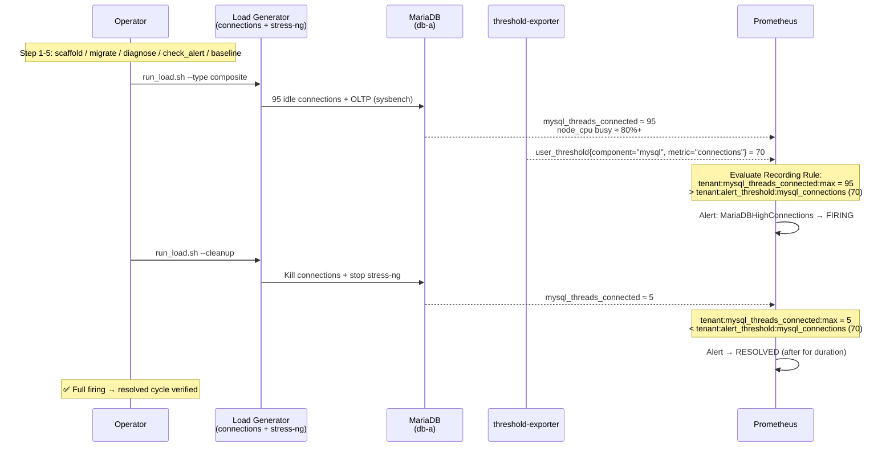

# Verified Scenarios & Platform Behavior

> **Language / 語言：** [中文](./verified-scenarios.md) | **English (current)**

> **Audience**: Platform Engineers / SREs / decision-makers — evaluating how the platform behaves under key scenarios, and whether those behaviors are actually verified.
>
> **Related**: [Architecture & Design](../architecture-and-design.en.md) · [Benchmarks](../benchmarks.en.md) · [Scenario Guide Index](README.md)

This document shows how the platform **behaves** under key scenarios and that those behaviors are **end-to-end verified** — maturity evidence for evaluators and SREs. The full test counts, CI commands and benchmark inventory are an internal QA record (see [Coverage overview](#coverage-overview)).

## Maintenance Mode & Composite Alerts

Every Alert Rule has built-in `unless maintenance` logic; a tenant can silence everything via a state_filter:

```yaml
# _defaults.yaml
state_filters:
  maintenance:
    reasons: []
    severity: "info"
    default_state: "disable"   # off by default

# Tenant enables maintenance mode:
tenants:
  db-a:
    _state_maintenance: "enable"  # all alerts suppressed by unless
```

Composite alerts (AND logic) and multi-tier severity (Critical auto-downgrade to Warning) are also fully implemented.

## Core Verified Scenarios

Six core scenarios are all **end-to-end verified** (inside a K8s cluster, from a config change through to alert firing/resolution):

| Scenario | Platform guarantee (E2E-verified) | Why it matters |
|----------|-----------------------------------|----------------|
| **A — Dynamic thresholds** | Tenant threshold changes take effect immediately, no restart | Self-service tuning without an ops ticket |
| **B — Weakest-link detection** | Alerts fire on the "worst" value across nodes / metrics | One bad node is caught, not diluted by averaging |
| **C — Three-state control** | Each metric can be custom / default / disable | Precise control over each alert's switch and threshold |
| **D — Maintenance mode** | Auto-silence during the window, auto-recover on expiry | Planned maintenance doesn't spam, and you can't forget to re-enable |
| **E — Multi-tenant isolation** | Changing tenant A's config **never** affects tenant B | The foundation of multi-tenant safety |
| **F — HA failover** | Service continues when a Pod dies; aggregate value doesn't double | High availability + data correctness |

The most important design proof and the end-to-end lifecycle are expanded below.

## Key Design Proof: `max by(tenant)` Prevents HA Double-Counting

threshold-exporter runs HA with 2 replicas; both Pods emit the same `user_threshold{tenant="db-a", metric="connections"} = 5`. The recording rule aggregates with `max by(tenant)`, not `sum`:

- ✅ `max(5, 5) = 5` (correct)
- ❌ With `sum by(tenant)`: `5 + 5 = 10` (doubled, wrong)

Scenario F kills one Pod and verifies the aggregate is still 5; after a replacement Pod starts, the series count returns to 2 but the aggregate stays 5 — directly proving that choosing **`max` over `sum`** is correct as Pod count changes, the key rationale of the HA design (see [Architecture & Design §High Availability](../architecture-and-design.en.md#4-high-availability-design)).

Multi-tenant isolation (Scenario E) is verified along two dimensions: **E1 threshold-change isolation** (lower db-a's threshold → only db-a fires; db-b's threshold and state are completely unaffected) and **E2 disable isolation** (set one db-a metric to `disable` → it vanishes from the exporter; db-b's same metric still emits normally).

## End-to-End Lifecycle (demo-full)

`make demo-full` showcases the full flow from tool validation to a real workload. The sequence diagram below describes the core path — how a real load fires an alert and how it auto-resolves after cleanup:



## Coverage Overview

- **6 core scenarios** (A–F) are all **end-to-end verified** (`make test-scenario-*` running inside a real K8s cluster).
- **2,000+ unit / integration tests** cover the enterprise feature domains: Silent Mode, Severity Dedup, Config-driven Routing, Per-rule Overrides, Cardinality Guard, Schema Validation, Migration Engine, Shadow Monitoring Cutover, Policy-as-Code, Alert Quality Scoring, and ~20 domains in total.
- **Tier 2 performance benchmarks** (1000–5000 tenant hot-path latency / memory / goroutines) give empirical grounding for SLO and sharding decisions — see [Benchmarks](../benchmarks.en.md) for the numbers.
- The CI pipeline runs the full test suite on **every PR**.

> The full test inventory (per-domain test counts, `make` commands, Tier 2 benchmark function mapping, measurement methodology) is an internal QA record; maintainers see `docs/internal/test-coverage-matrix.md`.

## Interactive Tools

> The following tools can be tried directly in the [Interactive Tools Hub](https://vencil.github.io/Dynamic-Alerting-Integrations/):
>
> - [PromQL Tester](https://vencil.github.io/Dynamic-Alerting-Integrations/assets/jsx-loader.html?component=../interactive/tools/promql-tester.jsx) — test alert-rule PromQL expressions
> - [Rule Pack Matrix](https://vencil.github.io/Dynamic-Alerting-Integrations/assets/jsx-loader.html?component=../interactive/tools/rule-pack-matrix.jsx) — view existing Rule Pack coverage
> - [Config Lint](https://vencil.github.io/Dynamic-Alerting-Integrations/assets/jsx-loader.html?component=../interactive/tools/config-lint.jsx) — validate advanced-scenario configs

## Related Resources

| Resource | Relevance |
|----------|-----------|
| [Scenario Guide Index](README.md) | ⭐⭐⭐ |
| [Scenario: Alert Routing Dual-Perspective Notification](alert-routing-split.en.md) | ⭐⭐ |
| [Scenario: Multi-Cluster Federation](multi-cluster-federation.en.md) | ⭐⭐ |
| [Scenario: Shadow Monitoring Automated Cutover](shadow-monitoring-cutover.en.md) | ⭐⭐ |
| [Performance Analysis & Benchmarks](../benchmarks.en.md) | ⭐⭐ |
| [BYO Alertmanager Integration Guide](../integration/byo-alertmanager-integration.en.md) | ⭐⭐ |
| [BYO Prometheus Integration Guide](../integration/byo-prometheus-integration.en.md) | ⭐⭐ |
