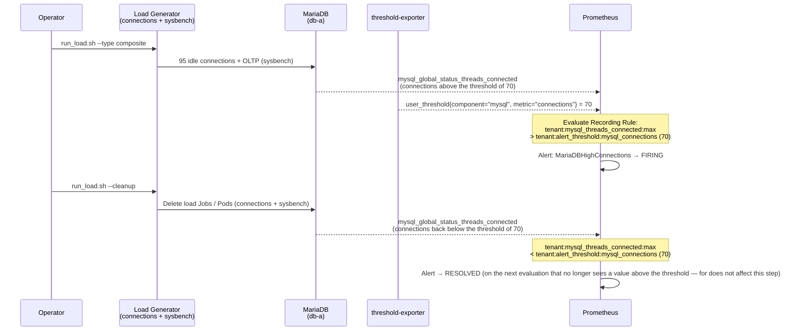

# Verified Scenarios & Platform Behavior

> **Language / 語言：** [中文](./verified-scenarios.md) | **English (current)**

> **Audience**: Platform Engineers / SREs / decision-makers — evaluating how the platform behaves under key scenarios, and whether those behaviors are actually verified.
>
> **Related**: [Architecture & Design](../architecture-and-design.en.md) · [Benchmarks](../benchmarks.en.md) · [Scenario Guide Index](README.md)

This document shows how the platform **behaves** under key scenarios, and **which automated mechanism actually guards each behavior — and where nothing does yet** — maturity evidence for evaluators and SREs. The CI commands and benchmark inventory are an internal QA record (see [Coverage overview](#coverage-overview)).

## Maintenance Mode & Composite Alerts

Every Alert Rule has built-in `unless maintenance` logic; a tenant can silence everything via a state_filter:

```yaml
# _defaults.yaml
state_filters:
  maintenance:
    reasons: []
    severity: "info"
    default_state: "disable"   # off by default

# Tenant enables maintenance mode:
tenants:
  db-a:
    _state_maintenance: "enable"  # all alerts suppressed by unless
```

Composite alerts (AND logic) and multi-tier severity (Critical auto-downgrade to Warning) are also fully implemented.

## Core Verified Scenarios

| Scenario | Platform guarantee | Why it matters |
|----------|--------------------|----------------|
| **A — Dynamic thresholds** | Tenant threshold changes take effect immediately, no restart | Self-service tuning without an ops ticket |
| **B — Weakest-link detection** | Alerts fire on the "worst" value across nodes / metrics | One bad node is caught, not diluted by averaging |
| **C — Three-state control** | A metric that has a platform default can be custom / default / disable (a declared key has nothing to inherit — only "set it" or "stay silent") | Precise control over each alert's switch and threshold |
| **D — Maintenance mode** | Auto-silence during the window, auto-recover on expiry | Planned maintenance doesn't spam, and you can't forget to re-enable |
| **E — Multi-tenant isolation** | Changing tenant A's config **never** affects tenant B | The foundation of multi-tenant safety |
| **F — HA failover** | Service continues when a Pod dies; aggregate value doesn't double | High availability + data correctness |

### What guards each guarantee

These guarantees are **not** guarded by a single end-to-end test in a K8s cluster; they are split across tests and lints at different layers (Go tests live in `components/threshold-exporter/app/`, promtool rule tests in `tests/rulepacks/`):

| Scenario | Guarding mechanism |
|----------|--------------------|
| **A** | Config hot-reload: `watchloop_test.go`, `config_symlink_reload_test.go`. The exporter → Prometheus → rule-pack fire chain (**static** config, no value change): `try-local/smoke.sh`, run on a daily schedule; the exporter is the published image pinned in `try-local/docker-compose.yaml`, not the current tree (the rule packs are), and it only checks that some critical alert is firing |
| **B** | Only "max across containers within one pod": the mixed-pod case in `rule-pack-kubernetes-cpu-node-share_test.yaml` |
| **C** | `TestResolve_ThreeState` in `config_resolve_test.go` |
| **D** | Maintenance silencing: `rule-pack-mariadb-threads_test.yaml`, plus the lint `scripts/tools/lint/check_maintenance_symmetry.py`, which checks that no arm of a two-arm alert drops its maintenance clause; expiry recovery: `config_silent_mode_test.go`; multi-tier severity: `TestConfigManager_LoadDir_CriticalSuffix` in `config_loaddir_test.go` |
| **E** | Config-resolution layer only, and as a single-config, one-pass resolution snapshot (no "change A, then check B"): `TestResolve_ThreeState` asserts that different per-tenant overrides or `disable` do not affect each other; `TestResolveStateFilters_PerTenantDisable` covers only a state filter's `disable` |
| **F** | No double-counting: the lint `scripts/tools/lint/check_ha_threshold_aggregation.py` (every aggregation of `user_threshold` must use `max`) |

**Gaps (no automated coverage today)**:

- Changing a threshold on a live cluster, or applying a real load and then clearing it, and watching the alert flip firing ↔ resolved (the end-to-end form of A and E, and the path described in the End-to-End Lifecycle section below).
- Taking the worst value across multiple pods / nodes of one tenant (the cross-pod half of B).
- Service continuing after a Pod is killed, with the PDB keeping at least one Pod (the failover half of F).
- `MariaDBHighConnections`, `MariaDBSystemBottleneck` (composite alert) and `ContainerImagePullFailure` have no firing test; they are listed under `uncovered` in `tests/rulepacks/vmalert_coverage_baseline.yaml`.

The most important design proof, and a description of the end-to-end lifecycle mechanism, are expanded below.

## Key Design Proof: `max by(tenant)` Prevents HA Double-Counting

threshold-exporter runs HA with 2 replicas; both Pods emit the same `user_threshold{tenant="db-a", metric="connections"} = 5`. The recording rule aggregates with `max by(tenant)`, not `sum`:

- ✅ `max(5, 5) = 5` (correct)
- ❌ With `sum by(tenant)`: `5 + 5 = 10` (doubled, wrong)

However the Pod count changes, `max` returns the same value — the rationale for choosing **`max` over `sum`** in the HA design (see [Architecture & Design §High Availability](../architecture-and-design.en.md#4-high-availability-design)).

## End-to-End Lifecycle

The sequence diagram below is a **description of the mechanism**: how a real load fires an alert through the recording rule compared against `user_threshold`, and how it auto-resolves after cleanup. ⚠️ **No automated test verifies this firing → resolved path on a live cluster** (see the gap list above).

To observe it manually on your own cluster, the entry points are:

```bash
make load-composite TENANT=<tenant>   # applies connections + sysbench OLTP together
make load-cleanup                     # deletes load-generator Jobs / Pods in db-* namespaces
```

`TENANT` must be a MariaDB tenant whose namespace name equals the tenant name: the load targets `mariadb.<tenant>.svc`, and `load-cleanup` only scans namespaces starting with `db-`.

In between, watch the alert state in Prometheus (`localhost:9090/alerts`). `for` only governs pending → firing; after cleanup, the alert resolves as soon as the next evaluation of the recording rule and alert rule no longer sees a value above the threshold (the rules set no `keep_firing_for`).


```mermaid
sequenceDiagram
    participant Op as Operator
    participant LG as Load Generator<br/>(connections + sysbench)
    participant DB as MariaDB<br/>(db-a)
    participant TE as threshold-exporter
    participant PM as Prometheus

    Op->>LG: run_load.sh --type composite
    LG->>DB: 95 idle connections + OLTP (sysbench)
    DB-->>PM: mysql_global_status_threads_connected<br/>(connections above the threshold of 70)
    TE-->>PM: user_threshold{component="mysql", metric="connections"} = 70

    Note over PM: Evaluate Recording Rule:<br/>tenant:mysql_threads_connected:max<br/>> tenant:alert_threshold:mysql_connections (70)

    PM->>PM: Alert: MariaDBHighConnections → FIRING

    Op->>LG: run_load.sh --cleanup
    LG->>DB: Delete load Jobs / Pods (connections + sysbench)
    DB-->>PM: mysql_global_status_threads_connected<br/>(connections back below the threshold of 70)

    Note over PM: tenant:mysql_threads_connected:max<br/>< tenant:alert_threshold:mysql_connections (70)

    PM->>PM: Alert → RESOLVED (on the next evaluation that no longer sees a value above the threshold — for does not affect this step)
```

## Coverage Overview

- For what guards **core scenarios A–F** and where the gaps are, see "What guards each guarantee" above.
- **Unit / integration tests** cover the enterprise feature domains: Silent Mode, Severity Dedup, Config-driven Routing, Per-rule Overrides, Cardinality Guard, Schema Validation, Migration Engine, Shadow Monitoring Cutover, Policy-as-Code, Alert Quality Scoring, and more.
- **Tier 2 performance benchmarks** (1000–5000 tenant hot-path latency / memory / goroutines) give empirical grounding for SLO and sharding decisions — see [Benchmarks](../benchmarks.en.md) for the numbers.
- The CI pipeline runs the full test suite on **every PR**.

> The full test inventory (`make` commands, Tier 2 benchmark function mapping, measurement methodology) is an internal QA record; maintainers see `docs/internal/test-coverage-matrix.md`.

## Interactive Tools

> The following tools can be tried directly in the [Interactive Tools Hub](https://vencil.github.io/Dynamic-Alerting-Integrations/):
>
> - [PromQL Tester](https://vencil.github.io/Dynamic-Alerting-Integrations/assets/jsx-loader.html?component=../interactive/tools/promql-tester.jsx) — test alert-rule PromQL expressions
> - [Rule Pack Matrix](https://vencil.github.io/Dynamic-Alerting-Integrations/assets/jsx-loader.html?component=../interactive/tools/rule-pack-matrix.jsx) — view existing Rule Pack coverage
> - [Config Lint](https://vencil.github.io/Dynamic-Alerting-Integrations/assets/jsx-loader.html?component=../interactive/tools/config-lint.jsx) — validate advanced-scenario configs

## Related Resources

| Resource | Relevance |
|----------|-----------|
| [Scenario Guide Index](README.md) | ⭐⭐⭐ |
| [Scenario: Alert Routing Dual-Perspective Notification](alert-routing-split.en.md) | ⭐⭐ |
| [Scenario: Multi-Cluster Federation](multi-cluster-federation.en.md) | ⭐⭐ |
| [Scenario: Shadow Monitoring Automated Cutover](shadow-monitoring-cutover.en.md) | ⭐⭐ |
| [Performance Analysis & Benchmarks](../benchmarks.en.md) | ⭐⭐ |
| [BYO Alertmanager Integration Guide](../integration/byo-alertmanager-integration.en.md) | ⭐⭐ |
| [BYO Prometheus Integration Guide](../integration/byo-prometheus-integration.en.md) | ⭐⭐ |
