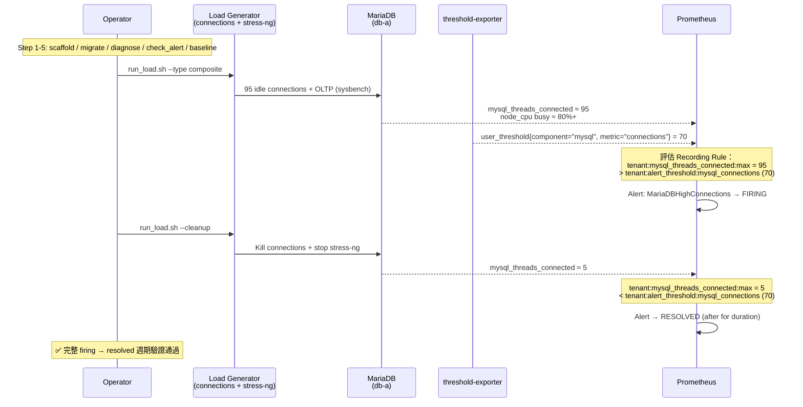

# 驗證場景與平台行為 (Verified Scenarios)

> **Language / 語言：** **中文（當前）** | [English](./verified-scenarios.en.md)

> **受眾**：Platform Engineer / SRE / 企業決策者——評估「平台在關鍵情境下怎麼運作、且這些行為是否真的被驗證」。
>
> **相關文件**：[架構與設計](../architecture-and-design.md) · [性能基準](../benchmarks.md) · [場景指南導覽](README.md)

這份文件展示平台在關鍵情境下的**行為**，以及這些行為都經**端到端驗證**——給評估者與 SRE 看的成熟度證據。完整測試數量、CI 指令與 benchmark 清單屬內部 QA 紀錄（見[覆蓋總覽](#覆蓋總覽)）。

## 維護模式與複合警報

所有 Alert Rules 內建 `unless maintenance` 邏輯，租戶可透過 state_filter 一鍵靜音：

```yaml
# _defaults.yaml
state_filters:
  maintenance:
    reasons: []
    severity: "info"
    default_state: "disable"   # 預設關閉

# 租戶啟用維護模式：
tenants:
  db-a:
    _state_maintenance: "enable"  # 所有警報被 unless 抑制
```

複合警報 (AND 邏輯) 與多層嚴重度 (Critical 自動降級 Warning) 也已完整實現。

## 核心驗證場景

六個核心場景全部經 **E2E 端到端驗證**（在 K8s 叢集內從配置改動跑到 alert 觸發/恢復）：

| 場景 | 平台保證（E2E 驗證） | 為何重要 |
|------|---------------------|---------|
| **A — 動態閾值** | 租戶改閾值即時生效、無需重啟 | 自助調整、不必開維運單 |
| **B — 弱環節偵測** | 多節點 / 多指標取「最差值」自動告警 | 一個節點壞掉就抓得到，不被平均稀釋 |
| **C — 三態控制** | 每個指標可 custom / default / disable | 精準控制每個告警的開關與閾值 |
| **D — 維護模式** | 維護窗口自動靜音、到期自動恢復 | 計劃性維護不洗版，且不會忘記開回來 |
| **E — 多租戶隔離** | 改租戶 A 的配置**絕不**影響租戶 B | 多租戶安全的根本保證 |
| **F — HA 故障切換** | Pod 掛掉服務不中斷、聚合值不翻倍 | 高可用 + 數據正確性 |

下面展開其中最關鍵的設計證明與端到端生命週期。

## 關鍵設計驗證：`max by(tenant)` 防 HA 翻倍

threshold-exporter 以 2 副本 HA 運行，兩個 Pod 各自吐出相同的 `user_threshold{tenant="db-a", metric="connections"} = 5`。Recording rule 用 `max by(tenant)` 聚合，而非 `sum`：

- ✅ `max(5, 5) = 5`（正確）
- ❌ 若用 `sum by(tenant)`：`5 + 5 = 10`（翻倍，錯誤）

Scenario F 在 Kill 一個 Pod 後驗證聚合值仍為 5，新 Pod 啟動後 series 數回到 2、但聚合值仍為 5——這直接證明了**選 `max` 而非 `sum`** 在 Pod 數量變動時的正確性，是高可用設計的關鍵根據（詳見[架構與設計 §高可用性](../architecture-and-design.md#4-高可用性設計-high-availability)）。

多租戶隔離（Scenario E）同理以兩個維度驗證：**E1 閾值修改隔離**（壓低 db-a 閾值 → 只有 db-a 觸發、db-b 閾值與狀態完全不受影響）與 **E2 disable 隔離**（db-a 某指標設 `disable` → 該指標從 exporter 消失、db-b 同指標仍正常產出）。

## 端到端生命週期 (demo-full)

`make demo-full` 展示從工具驗證到真實負載的完整流程。以下時序圖描述核心路徑——一個真實負載如何觸發告警、清除後又如何自動恢復：



## 覆蓋總覽

- **6 個核心場景**（A–F）全部 **E2E 端到端驗證**（`make test-scenario-*` 在真實 K8s 叢集內跑）。
- **2,000+ unit / integration 測試**覆蓋各企業功能域：Silent Mode、Severity Dedup、Config-driven Routing、Per-rule Overrides、Cardinality Guard、Schema Validation、Migration Engine、Shadow Monitoring Cutover、Policy-as-Code、Alert Quality Scoring 等約 20 個域。
- **Tier 2 性能 benchmark**（1000–5000 租戶 hot-path 延遲 / 記憶體 / goroutine）為 SLO 與 sharding 決策提供 empirical 依據——數字見[性能基準](../benchmarks.md)。
- CI pipeline 在**每次 PR** 自動執行全套測試。

> 完整測試清單（逐域測試數、`make` 指令、Tier 2 benchmark 函式對照、量測方法論）屬內部 QA 紀錄，維護者見 `docs/internal/test-coverage-matrix.md`。

## 互動工具

> 下列工具可直接在 [Interactive Tools Hub](https://vencil.github.io/Dynamic-Alerting-Integrations/) 中測試：
>
> - [PromQL Tester](https://vencil.github.io/Dynamic-Alerting-Integrations/assets/jsx-loader.html?component=../interactive/tools/promql-tester.jsx) — 測試告警規則的 PromQL 運算式
> - [Rule Pack Matrix](https://vencil.github.io/Dynamic-Alerting-Integrations/assets/jsx-loader.html?component=../interactive/tools/rule-pack-matrix.jsx) — 查看現有 Rule Pack 的覆蓋範圍
> - [Config Lint](https://vencil.github.io/Dynamic-Alerting-Integrations/assets/jsx-loader.html?component=../interactive/tools/config-lint.jsx) — 驗證進階場景配置

## 相關資源

| 資源 | 相關性 |
|------|--------|
| [場景指南導覽](README.md) | ⭐⭐⭐ |
| [場景：Alert Routing 雙視角通知](alert-routing-split.md) | ⭐⭐ |
| [場景：多叢集聯邦架構](multi-cluster-federation.md) | ⭐⭐ |
| [場景：Shadow Monitoring 全自動切換](shadow-monitoring-cutover.md) | ⭐⭐ |
| [性能分析與基準測試](../benchmarks.md) | ⭐⭐ |
| [BYO Alertmanager 整合指南](../integration/byo-alertmanager-integration.md) | ⭐⭐ |
| [BYO Prometheus 整合指南](../integration/byo-prometheus-integration.md) | ⭐⭐ |
