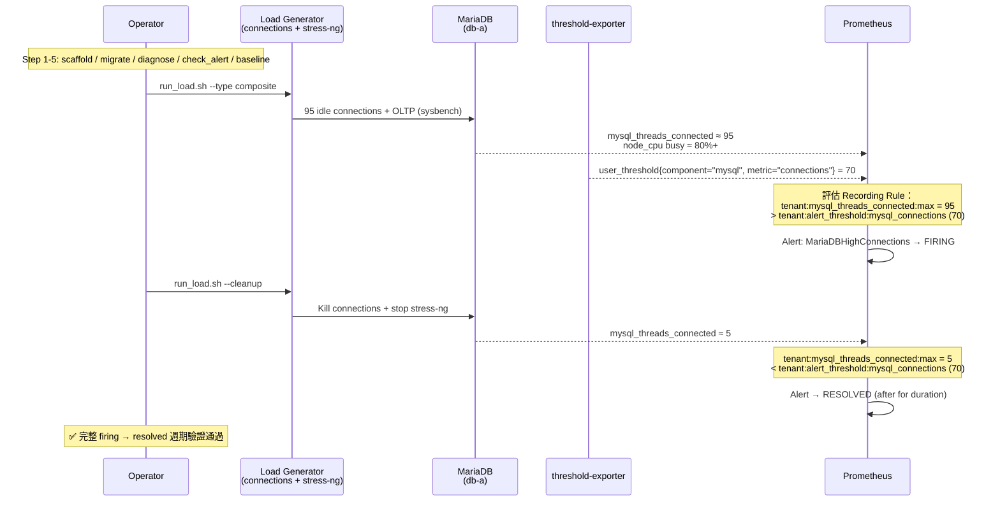

# 驗證場景與平台行為 (Verified Scenarios)

> **Language / 語言：** **中文（當前）** | [English](./verified-scenarios.en.md)

> **受眾**：Platform Engineer / SRE / 企業決策者——評估「平台在關鍵情境下怎麼運作、且這些行為是否真的被驗證」。
>
> **相關文件**：[架構與設計](../architecture-and-design.md) · [性能基準](../benchmarks.md) · [場景指南導覽](README.md)

這份文件展示平台在關鍵情境下的**行為**，以及每一項行為**實際由哪個自動化機制守著、哪裡還沒有**——給評估者與 SRE 看的成熟度證據。CI 指令與 benchmark 清單屬內部 QA 紀錄（見[覆蓋總覽](#覆蓋總覽)）。

## 維護模式與複合警報

所有 Alert Rules 內建 `unless maintenance` 邏輯，租戶可透過 state_filter 一鍵靜音：

```yaml
# _defaults.yaml
state_filters:
  maintenance:
    reasons: []
    severity: "info"
    default_state: "disable"   # 預設關閉

# 租戶啟用維護模式：
tenants:
  db-a:
    _state_maintenance: "enable"  # 所有警報被 unless 抑制
```

複合警報 (AND 邏輯) 與多層嚴重度 (Critical 自動降級 Warning) 也已完整實現。

## 核心驗證場景

| 場景 | 平台保證 | 為何重要 |
|------|---------|---------|
| **A — 動態閾值** | 租戶改閾值即時生效、無需重啟 | 自助調整、不必開維運單 |
| **B — 弱環節偵測** | 多節點 / 多指標取「最差值」自動告警 | 一個節點壞掉就抓得到，不被平均稀釋 |
| **C — 三態控制** | 有平台預設的指標可 custom / default / disable（宣告 key 無預設可繼承，只有「填值 / 靜默」兩態） | 精準控制每個告警的開關與閾值 |
| **D — 維護模式** | 維護窗口自動靜音、到期自動恢復 | 計劃性維護不洗版，且不會忘記開回來 |
| **E — 多租戶隔離** | 改租戶 A 的配置**絕不**影響租戶 B | 多租戶安全的根本保證 |
| **F — HA 故障切換** | Pod 掛掉服務不中斷、聚合值不翻倍 | 高可用 + 數據正確性 |

### 每項保證由什麼守

這些保證**不是**由單一的 K8s 叢集端到端測試守著，而是拆在各層的測試與 lint 裡（Go 測試在 `components/threshold-exporter/app/`，promtool 規則測試在 `tests/rulepacks/`）：

| 場景 | 守著它的機制 |
|------|-------------|
| **A** | 設定熱重載：`watchloop_test.go`、`config_symlink_reload_test.go`。exporter → Prometheus → rule pack 的觸發鏈（**靜態**設定、不改值）：`try-local/smoke.sh`，每日排程跑 |
| **B** | 規則 pack promtool 測試：`rule-pack-kubernetes-cpu-node-share_test.yaml`、`rule-pack-kubernetes-cpu-throttle_test.yaml`、`rule-pack-kubernetes_test.yaml` |
| **C** | `collector_test.go` 的 `TestCollector_StateFilter`；`config_resolve_test.go` 的 `TestResolve_ThreeState`、`TestResolveStateFilters_PerTenantDisable` |
| **D** | 維護靜音：`rule-pack-mariadb-threads_test.yaml`，以及檢查雙臂告警的 maintenance 子句沒有漏掉任一臂的 lint `scripts/tools/lint/check_maintenance_symmetry.py`；到期恢復：`config_silent_mode_test.go`；多層嚴重度：`config_loaddir_test.go` 的 `TestConfigManager_LoadDir_CriticalSuffix` |
| **E** | 只在設定解析層：`TestResolveStateFilters_PerTenantDisable`、`TestResolve_ThreeState` 以多租戶設定斷言一個租戶的改值或 `disable` 不影響另一個 |
| **F** | 聚合不翻倍：lint `scripts/tools/lint/check_ha_threshold_aggregation.py`（所有對 `user_threshold` 的聚合必須用 `max`） |

**缺口（目前沒有自動化覆蓋）**：

- 在 live 叢集改閾值、看 alert 翻轉 firing ↔ resolved（A、E 的端到端形態）。
- Kill Pod 後服務不中斷、PDB 保住至少一個 Pod（F 的故障切換半邊）。
- `MariaDBHighConnections`、`MariaDBSystemBottleneck`（複合警報）、`ContainerImagePullFailure` 沒有觸發測試，列在 `tests/rulepacks/vmalert_coverage_baseline.yaml` 的 `uncovered`。

下面展開其中最關鍵的設計證明與端到端生命週期。

## 關鍵設計驗證：`max by(tenant)` 防 HA 翻倍

threshold-exporter 以 2 副本 HA 運行，兩個 Pod 各自吐出相同的 `user_threshold{tenant="db-a", metric="connections"} = 5`。Recording rule 用 `max by(tenant)` 聚合，而非 `sum`：

- ✅ `max(5, 5) = 5`（正確）
- ❌ 若用 `sum by(tenant)`：`5 + 5 = 10`（翻倍，錯誤）

Pod 數量怎麼變，`max` 的結果都不變，這是高可用設計選 **`max` 而非 `sum`** 的根據（詳見[架構與設計 §高可用性](../architecture-and-design.md#4-高可用性設計-high-availability)）。

## 端到端生命週期 (demo-full)

`make demo-full` 展示從工具驗證到真實負載的完整流程。以下時序圖描述核心路徑——一個真實負載如何觸發告警、清除後又如何自動恢復：


```mermaid
sequenceDiagram
    participant Op as Operator
    participant LG as Load Generator<br/>(connections + stress-ng)
    participant DB as MariaDB<br/>(db-a)
    participant TE as threshold-exporter
    participant PM as Prometheus

    Note over Op: Step 1-5: scaffold / migrate / diagnose / check_alert / baseline

    Op->>LG: run_load.sh --type composite
    LG->>DB: 95 idle connections + OLTP (sysbench)
    DB-->>PM: mysql_threads_connected ≈ 95<br/>node_cpu busy ≈ 80%+
    TE-->>PM: user_threshold{component="mysql", metric="connections"} = 70

    Note over PM: 評估 Recording Rule：<br/>tenant:mysql_threads_connected:max = 95<br/>> tenant:alert_threshold:mysql_connections (70)

    PM->>PM: Alert: MariaDBHighConnections → FIRING

    Op->>LG: run_load.sh --cleanup
    LG->>DB: Kill connections + stop stress-ng
    DB-->>PM: mysql_threads_connected ≈ 5

    Note over PM: tenant:mysql_threads_connected:max = 5<br/>< tenant:alert_threshold:mysql_connections (70)

    PM->>PM: Alert → RESOLVED (after for duration)
    Note over Op: ✅ 完整 firing → resolved 週期驗證通過
```

## 覆蓋總覽

- **核心場景 A–F** 各由哪個測試或 lint 守、缺口在哪，見上方「每項保證由什麼守」一節。
- **unit / integration 測試**覆蓋各企業功能域：Silent Mode、Severity Dedup、Config-driven Routing、Per-rule Overrides、Cardinality Guard、Schema Validation、Migration Engine、Shadow Monitoring Cutover、Policy-as-Code、Alert Quality Scoring 等。
- **Tier 2 性能 benchmark**（1000–5000 租戶 hot-path 延遲 / 記憶體 / goroutine）為 SLO 與 sharding 決策提供 empirical 依據——數字見[性能基準](../benchmarks.md)。
- CI pipeline 在**每次 PR** 自動執行全套測試。

> 完整測試清單（`make` 指令、Tier 2 benchmark 函式對照、量測方法論）屬內部 QA 紀錄，維護者見 `docs/internal/test-coverage-matrix.md`。

## 互動工具

> 下列工具可直接在 [Interactive Tools Hub](https://vencil.github.io/Dynamic-Alerting-Integrations/) 中測試：
>
> - [PromQL Tester](https://vencil.github.io/Dynamic-Alerting-Integrations/assets/jsx-loader.html?component=../interactive/tools/promql-tester.jsx) — 測試告警規則的 PromQL 運算式
> - [Rule Pack Matrix](https://vencil.github.io/Dynamic-Alerting-Integrations/assets/jsx-loader.html?component=../interactive/tools/rule-pack-matrix.jsx) — 查看現有 Rule Pack 的覆蓋範圍
> - [Config Lint](https://vencil.github.io/Dynamic-Alerting-Integrations/assets/jsx-loader.html?component=../interactive/tools/config-lint.jsx) — 驗證進階場景配置

## 相關資源

| 資源 | 相關性 |
|------|--------|
| [場景指南導覽](README.md) | ⭐⭐⭐ |
| [場景：Alert Routing 雙視角通知](alert-routing-split.md) | ⭐⭐ |
| [場景：多叢集聯邦架構](multi-cluster-federation.md) | ⭐⭐ |
| [場景：Shadow Monitoring 全自動切換](shadow-monitoring-cutover.md) | ⭐⭐ |
| [性能分析與基準測試](../benchmarks.md) | ⭐⭐ |
| [BYO Alertmanager 整合指南](../integration/byo-alertmanager-integration.md) | ⭐⭐ |
| [BYO Prometheus 整合指南](../integration/byo-prometheus-integration.md) | ⭐⭐ |
