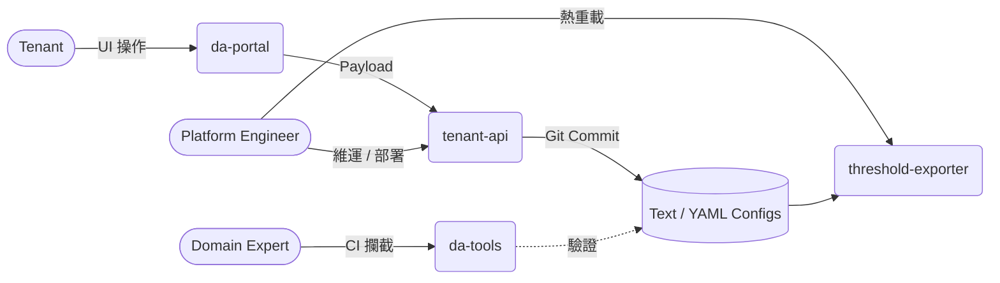

# Try it locally — Dynamic Alerting in one command

> Spin up the whole platform on your laptop and watch a real alert fire. No Kubernetes, no cloud, no signup. / 一鍵在本機跑起整套平台，看著一個真實告警亮紅燈。

```bash
cd try-local
cp .env.example .env
docker compose up -d
```

> ℹ️ 首次啟動會從原始碼 **build tenant-api**（~1 分鐘）—— 它依賴的 `--dev-bypass-auth`（讓瀏覽器免 oauth2-proxy 也能登入）尚未發佈成 published image。之後的啟動會重用已 build 的 image；改了 tenant-api 原始碼後用 `docker compose up -d --build` 重建。其餘 3 個 component 用 published image。

> ⏱️ **TTV：< 1 分鐘**（核心雙星 ~10 秒起）· 🟢 **摩擦：只需 Docker**（Windows 需 WSL2 + Docker Desktop）。

Give it ~1 minute, then open:

| 產品 | 開這個 | 你會看到 |
|---|---|---|
| **Tenant Manager**（da-portal） | <http://localhost:8081> | 2 個 demo 租戶 + 一個預存的 Saved View；建立/儲存一個 Saved View 會落一個**真實 git commit** |
| **Tenant API**（tenant-api） | <http://localhost:8080/api/v1/me> | file-based 設定 API（commit-on-write），oauth2-proxy 身分模型 |
| **Prometheus** | <http://localhost:9090/alerts> | `MariaDBHighConnectionsCritical` **正在 firing**（紅燈） |
| **Alertmanager** | <http://localhost:9093> | 同一個 firing 告警，路由到 null receiver |

背後還有 **threshold-exporter**（把 config 變成 `user_threshold` 指標）和 **pushgateway**（裝載 seed 推進去的合成 DB 指標）。

還有 **Grafana**（<http://localhost:3000>）—— 這是「Act 2」：正式生產環境用的**聯邦撤銷安全儀表板**，在本機用合成資料點亮（資料是 demo，儀表板與門檻是真的）。詳見下方 [Act 2](#act-2企業安全縱深聯邦撤銷儀表板)。

驗證整條鏈是否正常：

```bash
make smoke-local      # 需要 make + curl + jq；無 make 時：bash try-local/smoke.sh
```

完整清理（含匿名 volume，第二次啟動乾淨無殘留）：

```bash
make clean-local      # 無 make 時：docker compose down -v --remove-orphans
```

---

## 4 個產品、3 種角色（誰用什麼）

這套 stack 一次帶出 4 個可獨立採用的產品，分屬不同角色：



> **協作閉環**：Tenant 透過 **da-portal** 發起變更 → Platform Engineer 以 Git / 純文字安全落地（**tenant-api** + **threshold-exporter**）→ Domain Expert 用 **da-tools** 在 CI 守監控預算（cardinality budget）。

- **Tenant** → **da-portal**（瀏覽器調閾值 / Saved View）· [QUICKSTART](../components/da-portal/QUICKSTART.md)
- **Platform Engineer** → **tenant-api** + **threshold-exporter**（設定 API / 部署 / 熱重載）· QUICKSTART：[tenant-api](../components/tenant-api/QUICKSTART.md) · [threshold-exporter](../components/threshold-exporter/QUICKSTART.md)
- **Domain Expert** → **da-tools**（CI 護欄 / 遷移 / scaffold）· [QUICKSTART](../components/da-tools/app/QUICKSTART.md)

---

## 兩種跑法

**① 完整 stack**（上面那個）— 8 個長駐服務（含 Grafana）+ 2 個 one-shot seed + 1 個持續 mock seed，能看到 live 告警紅燈，外加 Act 2 的聯邦撤銷安全儀表板。

**② 只跑核心雙星**（Tenant Manager，不含監控）：

```bash
docker compose up da-portal tenant-api
```

只起 portal + tenant-api（外加一個秒退的 git-init one-shot）。打開 <http://localhost:8081>，瀏覽 2 個租戶、建立一個 Saved View 按 **Save** —— 然後在 host 上看 seed 設定 repo 多了一個真實 commit：

```bash
git -C try-local/seed/conf.d log --oneline
```

這就是「設定即 GitOps」最直接的體感：UI 一按 = 一個 commit。

## 看點

- **紅燈在哪**：告警狀態看 Prometheus `:9090/alerts` 和 Alertmanager `:9093` —— **portal 不顯示 live 告警**（它管設定，不管告警路由）。
- **為什麼會 fire**：seed 往 pushgateway 推了一筆 `mysql_global_status_threads_connected{tenant="db-demo"}=200`，超過 `db-demo` 設定的 critical 閾值 120 → DB rule pack 的 critical 規則 `for:30s` 後觸發。
- **設計概念展示**：第二個租戶 `cache-demo` 開了 silent_mode + severity dedup，會產生 v2.8.0 的 **Sentinel Alert / Severity Dedup** sentinel（`severity:none`，notification inhibit 來源）。

## Act 2：企業安全縱深（聯邦撤銷儀表板）

> MariaDB 紅燈是主秀；這是**紅燈背後的企業級安全縱深**——想看就看，是邀請，不是必看。

多租戶聯邦（ADR-020/ADR-028）讓租戶跨叢集互信。隨之而來的攻擊面：一個帶著合法 Service Account 身分、具寫入權的行為者，可能**偷偷抹掉一筆撤銷紀錄**（un-revoke），讓一個「已撤銷但還沒過期」的 token 復活。這種竄改連 workload identity 稽核都看不到——所以需要一個**對帳器（reconciler）**持續比對「離線撤銷日誌 vs. 線上撤銷集合」，任何缺口就亮燈。這就是 **ADR-028 的 tamper-evidence 控制**。

打開 **Grafana**：<http://localhost:3000>

- 首頁是一張**demo 說明卡**（先說清楚：這裡是合成資料），點卡片裡的連結進 **Federation Revocation Reconciler** 儀表板。
- 健康時全部 calm-green：**Tamper status** ✓ Clean、**Reconciler freshness** ✓ Fresh（活的綠色鋸齒，不是 stale）、**Gateway fail-open** ✓ OK、**Coverage integrity** ✓ Intact。
- 下方的 chaos-scenario 時序圖展示「壞掉長怎樣」（staleness 爬過 1800s、events dropped 上升、tamper > 0）——這裡保持平坦，因為 mock 只發健康的靜止值。

> 🧪 **資料是合成的，儀表板是真的**：`mock-reconciler` 這個小容器每 ~15s 往 pushgateway 推 6 個平台級指標（`last_reconcile_ts` 每次都設成 now，才不會讓 freshness 假性變紅）。**但那張儀表板 JSON 是 production 的正本**——直接從 `k8s/03-monitoring/federation-revocation-dashboard.json` **唯讀掛載**進來，門檻與 alert 對齊都跟正式環境一模一樣，沒有為 demo 改一個字。真正的對帳器（`helm/federation-reconciler`）要接 VictoriaLogs 從真實撤銷日誌算出這些數字——那需要 Kubernetes，不在這個一鍵 laptop demo 範圍內。細節見 **ADR-028**。

## 關於身分（dev-only auth bypass）

完整 production 由 oauth2-proxy 在前面注入 `X-Forwarded-Email` / `X-Forwarded-Groups`。try-local 沒有 oauth2-proxy，所以 tenant-api 用 `--dev-bypass-auth`（**僅限本機**）在缺 header 時注入一個 dev 身分（`dev@local` / `demo-admins`），瀏覽器才打得開 Tenant Manager。

> ⚠️ 這個 flag 嚴禁進 production：在 Kubernetes 內啟動會直接 panic，且 SAST 禁止它出現在任何部署 manifest。細節見 ADR-022。

`demo-admins` 在 `seed/conf.d/_rbac.yaml` 對應 `tenants: ["*"]`（這是 `/api/v1/me` 通過授權閘所必需的）。因此 `/api/v1/me` 回的 `accessible_tenants` 是 `["*"]`；想看到 2 個租戶清單請打 `GET /api/v1/tenants`（這也是 portal Tenant Manager 顯示的來源）。

## Port 衝突

所有 port 只綁 `127.0.0.1`（本機限定）—— dev-bypass 會為無 header 的請求注入 **admin** 身分，故刻意不對 LAN 開放（避免同網段他人取得寫入/commit 權）。要從別台裝置連，請自行改 compose 的 port binding。

預設用 3000 / 8080 / 8081 / 8082 / 9090 / 9091 / 9093。若被占用，編輯 `.env`（從 `.env.example` 複製來的）改任一 `EXPOSE_*_PORT` 後重啟：

```bash
make clean-local && docker compose up -d
```

## Windows / WSL2（必讀）

- Windows 使用者**必須**用 **WSL2 + Docker Desktop（WSL2 backend）**。
- **不要**從原生 Windows 路徑（`C:\...`）跑 —— bind mount 行為不保證。把 repo clone 到 **WSL2 檔案系統內**（如 `~/…`）再跑。
- 本 stack 多用匿名 volume；唯一 bind mount 是 `seed/conf.d`（read-write，用來承接 portal Save 的 git commit）。
- seed 會在 `seed/conf.d` 內 `git init`（runtime 產生的 `.git/` 已被 `.gitignore` 忽略）。Save 會改到這些被追蹤的 YAML —— `make clean-local` 後用 `git checkout try-local/seed/conf.d` 可還原 demo 初始狀態。

## 排錯

| 症狀 | 處理 |
|---|---|
| `docker compose up` 拉不到 image | image 在 `ghcr.io/vencil/*`；確認網路可達 ghcr.io。exporter/portal 目前是 amd64-only，Apple Silicon 會以 emulation 跑（較慢；原生多架構見 #463）。tenant-api 從源碼 build，為主機原生 arch。 |
| `:9090/alerts` 一直沒紅燈 | 給它 ~1–2 分鐘（recording rule 15s interval + 規則 `for:30s`）。仍沒有就 `docker compose logs seed-metrics prometheus`。 |
| 紅燈本來有、後來消失了 | pushgateway 是記憶體型（無持久化）—— 若單獨重啟它，seed 推的合成值會消失。重推：`docker compose up -d seed-metrics`。 |
| portal 開了但 API 502 | tenant-api 還在起；稍等。確認 `docker compose ps` 中 tenant-api 是 running。 |
| `make smoke-local` 說找不到 jq | 安裝 `jq`（smoke 需要 curl + jq）。 |

## 想試 da-tools（CLI）？

對 seed 設定跑一次護欄檢查（cardinality / schema / routing）：

```bash
docker run --rm -v "$PWD/seed/conf.d:/conf.d:ro" \
  ghcr.io/vencil/da-tools:${TOOLS_TAG:-v2.8.0} guard defaults-impact --config-dir /conf.d
```

> 🪟 **Git Bash（MSYS）使用者**：前面加 `MSYS_NO_PATHCONV=1`，否則容器內路徑 `/conf.d` 會被改寫成 Windows 路徑（在 WSL2 下不會發生）。

> 想完整動手跑 CLI 工作流（init → 閾值 → 路由 → blast radius）？→ [Hands-on Lab](../docs/scenarios/hands-on-lab.md)（`⏱️ 30–45 min`，da-tools 深度教學）。這是 try-local（1 分鐘看產品）的下一層深度。

## Next Step：上 Production（Kubernetes）

try-local 跑順了、看對胃口 —— 下一步是評估正式部署到 Kubernetes：

- **Helm charts** → [`helm/`](../helm/)（`da-portal` / `tenant-api` / `threshold-exporter`；da-tools 是 CLI image，無 chart）
- **按角色入門**（接你剛試的那個產品的下一步）：
    - **Tenant**（剛在 da-portal 調閾值的你）→ [閾值配置與自助管理](../docs/getting-started/for-tenants.md)
    - **Platform Engineer** → [架構部署與運維](../docs/getting-started/for-platform-engineers.md)
    - **Domain Expert** → [Rule Pack 客製與品質治理](../docs/getting-started/for-domain-experts.md)
- **接上既有 Prometheus** → [BYO Prometheus](../docs/integration/byo-prometheus-integration.md) · [Prometheus Operator](../docs/integration/prometheus-operator-integration.md)

> ⚠️ try-local 用的 `--dev-bypass-auth` + `127.0.0.1`-only binding 是**本機限定**捷徑；production 改由 oauth2-proxy 注入身分、Helm values 控管（見 [ADR-022](../docs/adr/022-dev-auth-bypass-four-layer-containment.md)）。

